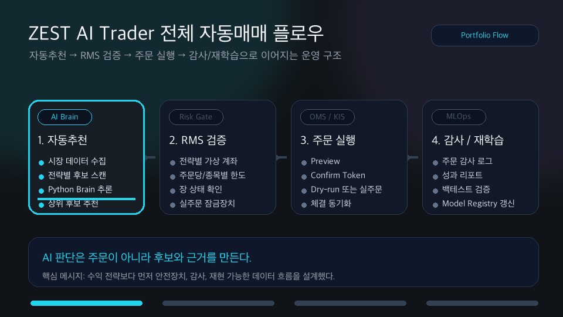
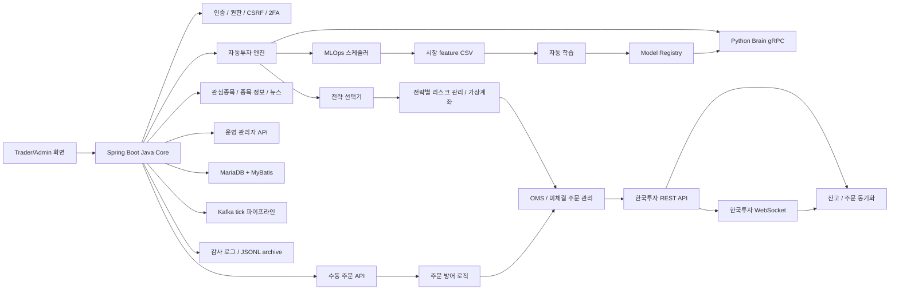
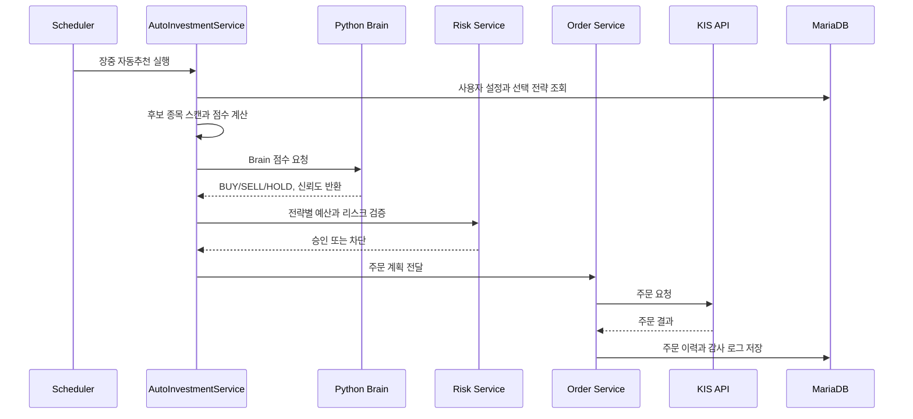
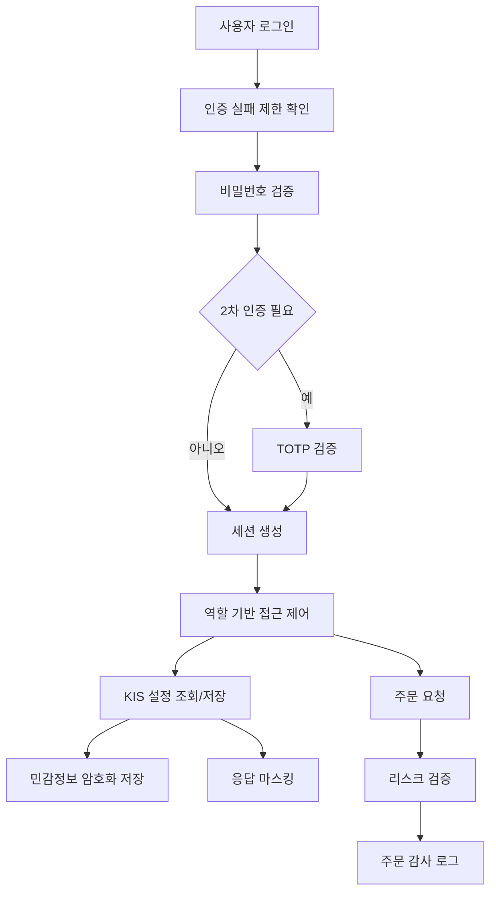
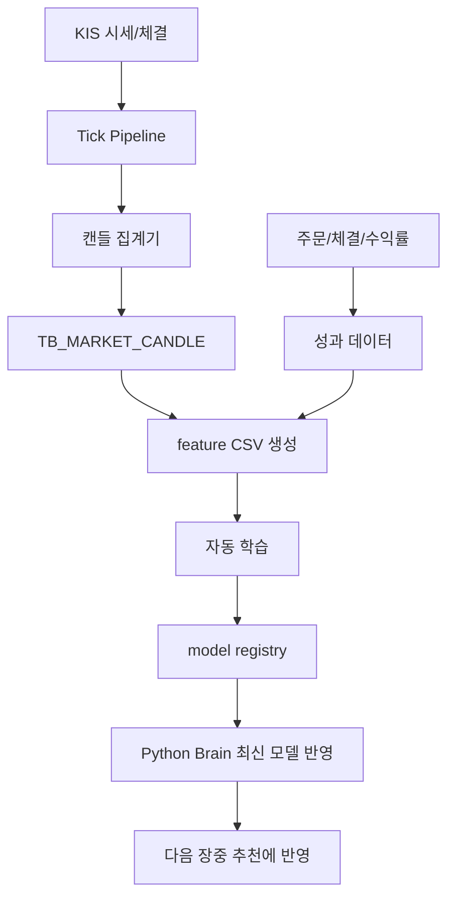

# ZEST AI Trader


> 한국투자증권 Open API, Spring Boot, Python Brain, gRPC, MyBatis 기반으로 만든 AI 자동매매 포트폴리오 프로젝트입니다.
> 단순 주문 화면이 아니라 `자동추천 -> 리스크 검증 -> 주문 실행 -> 체결 동기화 -> 성과 평가 -> 재학습`까지 이어지는 운영 흐름을 설계하고 구현했습니다.
> CI 보안 점검은 [GitHub Actions security workflow](.github/workflows/security.yml)에서 Gradle 테스트와 OSV 의존성 점검으로 관리합니다.

`local` 프로필로 실행하면 `/trader` 화면에서 자동추천 결과, RMS 안전장치, 주문 검증, 거래 내역, 백테스트 결과를 한 흐름으로 확인할 수 있습니다. 이 README는 화면 하나를 보여주는 데서 끝내지 않고, 자동매매 시스템을 어떻게 안전하게 운영하도록 설계했는지까지 함께 설명합니다.


<p align="left">
[ZEST AI Trader 전체 자동매매 플로우]
</p>
<p align="left">


</p>


| 항목 | 내용 |
| --- | --- |
| 문서 버전 | README v2026.07.03 |
| 포트폴리오 한 줄 소개 | 실제 증권사 API와 AI 판단 엔진을 연결한 자동매매 운영 시스템 |
| 담당 역할 | Java Core, Python Brain, KIS 연동, OMS/RMS, 보안/감사, 데이터 파이프라인 설계 및 구현 |
| 주요 기술 | Java 17, Spring Boot 3.5, MyBatis, MariaDB, gRPC, Python 3.13, Kafka, Redis, WebSocket, GitHub Actions |
| 실행 방식 | 로컬 Java Core `8090`, Python Brain gRPC `50051` |
| 상세 문서 | [아키텍처 문서](docs/architecture.md), [배포/실행 가이드](docs/deployment-guide.md), [Python Brain 가이드](docs/python-brain-local-guide.md), [보안 운영 가이드](docs/SECURITY_OPERATION_GUIDE.md) |

## 1. 이 프로젝트가 해결하는 문제

개인 투자 자동화 프로젝트는 보통 “매수 버튼을 누르는 프로그램”에서 멈추기 쉽습니다. 하지만 실제 서비스 수준으로 보려면 질문이 달라진다고 생각했습니다.

- 외부 증권사 API가 실패하면 주문을 멈출 수 있을까요?
- AI 판단과 주문 실행 책임을 분리했을까요?
- 사용자의 계좌 정보와 API key를 안전하게 다룰 수 있을까요?
- 전략별 성과를 기록하고 다음 운용에 반영할 수 있을까요?
- 장애가 났을 때 누가, 언제, 어떤 주문을 요청했는지 추적할 수 있을까요?

ZEST AI Trader는 이 질문에 답하기 위해 만든 프로젝트입니다. 단순히 기능을 많이 붙이는 것보다, 실제 운영 상황에서 문제가 생겼을 때 막고 추적할 수 있는 구조를 만드는 데 초점을 두었습니다.

## 2. 5초 요약

README 첫 화면에서 이 프로젝트의 문제, 역할, 실행 방법, 기술 판단이 바로 보이도록 정리했습니다.

| 질문 | 답 |
| --- | --- |
| 무엇을 만들었나요 | 한국투자증권 Open API 기반 AI 자동매매 플랫폼입니다 |
| 어떤 역할을 맡았나요 | 백엔드, AI 연동, 주문 안전장치, 보안, 데이터/운영 문서까지 직접 설계했습니다 |
| 왜 어려웠나요 | 주문 시스템은 API 장애, 과매수, 중복 주문, secret 노출, 감사 누락이 바로 사고로 이어질 수 있습니다 |
| 어떻게 풀었나요 | Java Core가 주문과 리스크를 책임지고, Python Brain이 AI 추론만 담당하도록 분리했습니다 |
| 무엇을 검증했나요 | 로컬 실행, Brain 연동 확인, Gradle 테스트, OSV 의존성 점검, 주문 감사/리스크 흐름을 확인했습니다 |
| 어디를 보면 되나요 | 실행은 [Runbook](#9-runbook-실행-절차), 구조는 [Architecture](#7-architecture-구조), 장애 대응은 [Troubleshooting](#11-troubleshooting-문제-해결)에 정리했습니다 |

## 3. 기술 스택

이 프로젝트는 단순히 기술 이름을 많이 붙이는 방식이 아니라, 자동매매 시스템을 운영 가능한 구조로 만들기 위해 필요한 역할별 기술을 나누어 사용했습니다. README에서는 각 기술을 어디에 썼고, 왜 선택했는지까지 함께 설명합니다.

| 영역 | 사용 기술 | 적용 위치 | 선택 이유와 보여주는 역량 |
| --- | --- | --- | --- |
| Backend | Java 17, Spring Boot 3.5, Spring Security, MyBatis | 인증, 주문 API, OMS/RMS, 관리자 API, KIS 연동 | 주문과 리스크 제어는 안정성이 중요해서 Java Core가 책임지도록 구성했습니다. SQL 추적이 필요한 금융 도메인 특성을 고려해 MyBatis를 사용했습니다 |
| Frontend | HTML, CSS, Vanilla JavaScript, Chart.js | `/trader`, `/admin`, 로그인/2차 인증 화면 | 프레임워크 의존보다 화면 흐름과 API 상태를 명확히 보여주는 데 집중했습니다. 자동추천, 주문, 잔고, 감사 흐름을 한 화면에서 확인할 수 있도록 구성했습니다 |
| Data | MariaDB, MyBatis Mapper, OHLCV candle, JSONL archive | 주문 내역, AI 판단 로그, 전략 성과, 감사 로그, 캔들 데이터 | 주문 결과와 AI 판단을 나중에 다시 분석할 수 있도록 저장 구조를 나누었습니다. raw tick 전체 저장보다 캔들 집계를 우선해 조회 성능과 운영 비용을 함께 고려했습니다 |
| AI | Python 3.13, gRPC, Protobuf, CNN/LSTM, PPO/SAC adapter | Python Brain, 전략별 AI 판단, model registry, smoke test | AI 모델은 Python Brain이 담당하고 주문 실행은 Java Core가 담당하도록 분리했습니다. 모델을 바꿔도 주문 코드가 흔들리지 않도록 gRPC 계약을 기준으로 연결했습니다 |
| Security | Spring Security, CSRF, 2FA, 역할 기반 권한, secret 암호화, masking | 로그인, 관리자 기능, KIS 설정, 주문 실행, API 응답 | 실계좌와 연결될 수 있는 프로젝트라 인증, 권한, 민감정보 보호, 주문 잠금장치를 먼저 설계했습니다. 화면과 로그에 secret이 노출되지 않도록 마스킹과 암호화를 적용했습니다 |
| DevOps | Gradle, GitHub Actions, OSV Scan, local profile, smoke test | 빌드, 테스트, 보안 점검, 로컬 실행 검증 | 로컬에서 재현 가능한 실행 절차와 CI 보안 점검을 함께 관리했습니다. README만 보고도 실행, 검증, 장애 확인 흐름을 따라갈 수 있도록 구성했습니다 |

| 관점 | 핵심 설명 |
| --- | --- |
| 기술 조합 | `Spring Boot Java Core + Python Brain gRPC + MariaDB + MyBatis + GitHub Actions` 구조입니다 |
| 가장 중요한 설계 | AI 판단과 주문 실행을 분리해 모델 실험과 주문 안정성을 동시에 확보했습니다 |
| 포트폴리오 포인트 | 기능 구현뿐 아니라 장애, 보안, 감사, 재학습까지 고려한 운영형 프로젝트라는 점을 보여줍니다 |

## 4. Demo: 실행 증거

현재는 공개 배포 URL 대신 로컬에서 재현할 수 있는 실행 가이드와 실제 브라우저 캡처 GIF를 증거로 두었습니다. 실계좌 주문으로 이어질 수 있는 프로젝트라서, 공개 데모보다 안전한 재현성과 실주문 없는 검증 흐름을 우선했습니다.

### 실제 브라우저 데모 GIF


`local` 프로필로 서버를 실행한 뒤 `/trader` 화면에서 아래 흐름을 직접 확인합니다. 자동추천 결과 확인, RMS 안전장치 점검, 차트 기반 주문 검증, 거래 내역과 백테스트 기반 감사/재학습 확인까지 이어집니다. 주문 화면에서는 일봉 차트, 거래량, 모의 주문/실주문 요청/체결 완료 마커를 함께 확인할 수 있습니다.

| 단계 | 실제 화면에서 확인하는 내용 | 포트폴리오에서 보여주는 역량 |
| --- | --- | --- |
| 자동추천 | 전략 성과, 자동추천 리포트, 뉴스/기술 점수, 최근 AI 판단을 확인합니다 | AI 판단 결과를 화면과 운영 지표로 연결했습니다 |
| RMS 검증 | 실주문 허용, 자동주문 허용, 주문 한도, 손실 한도를 확인합니다 | 주문 전에 위험을 차단하는 안전장치를 설계했습니다 |
| 주문 | 관심종목, 종목 검색, 회사 정보, 전략, 단가, 수량, 차트, 주문 마커, 주문 결과 메시지를 확인합니다 | 주문 요청과 실패 응답을 사용자 화면에서 추적할 수 있게 했습니다 |
| 감사/재학습 | 거래 내역, 기간별/종목별 수익률, 백테스트 결과, 캔들 백필 상태를 확인합니다 | 주문 결과를 감사 로그와 재학습 데이터로 이어지게 했습니다 |

### 직무별 관점 확장 문서

| 관점 | 문서 | 무엇을 보여주나요 |
| --- | --- | --- |
| Backend | [backend.md](docs/career/backend.md) | API, OMS/RMS, KIS 연동, 주문 안전장치 흐름 |
| Frontend | [frontend.md](docs/career/frontend.md) | Trader 화면에서 자동추천, 주문, 감사 정보를 탐색하는 흐름 |
| Data | [data.md](docs/career/data.md) | AI 판단 로그, 성과 리포트, 재학습 근거 확인 흐름 |
| Security | [security.md](docs/career/security.md) | 보안 설정, 인증, 주문 잠금, 감사 관점의 점검 흐름 |

| 확인 항목 | 경로 |
| --- | --- |
| Trader 화면 | `http://localhost:8090/trader` |
| 상태 API | `GET http://localhost:8090/api/status` |
| Python Brain 연동 확인 | `python/.venv/bin/python python/scripts/smoke_test.py` |
| 운영 문서 | [docs/deployment-guide.md](docs/deployment-guide.md) |
| Python Brain 문서 | [docs/python-brain-local-guide.md](docs/python-brain-local-guide.md) |

```bash
cd /Users/namgukang/git/zestStockAI
python/scripts/setup_local.sh
python/scripts/run_brain.sh
```

다른 터미널에서 Java Core를 실행합니다.

```bash
cd /Users/namgukang/git/zestStockAI
./gradlew bootRun
```

정상 실행 후 `http://localhost:8090/trader`에 접속합니다.

## 5. Features: 핵심 기능

### 자동매매와 리스크 통제

- 자동추천 종목을 스캔하고 전략별 점수, 성과, AI Brain 점수를 합산해 주문 후보를 만듭니다.
- 신규 자동매수는 성과 기반 상위 3개 전략이 각각 종목 1개를 선택하도록 설계했습니다.
- 전체 평가자산의 70%만 운용하고 30%는 비상 현금으로 두었습니다.
- 기본 손절, 강제 손절, 당일 목표수익 달성 후 거래 중지, 트레일링 스탑을 적용했습니다.
- 미체결 주문은 만료, 취소, 재주문, 다음 후보 전환 흐름으로 관리합니다.
- 시장 캘린더와 장마감 시간을 기준으로 자동추천/백필/장중 작업의 실행 가능 여부를 판단합니다.

### Java Core와 Python Brain 분리

- Java Core는 인증, 주문, 한국투자 API, 리스크, DB, 화면을 담당합니다.
- Python Brain은 gRPC 기반 AI 추론과 전략 라우팅을 담당합니다.
- Protobuf 계약으로 Java와 Python 경계를 고정해 모델을 교체해도 주문 코드가 흔들리지 않도록 했습니다.

### 보안과 감사

- KIS App Key, App Secret, 계좌번호, HTS ID를 암호화 저장하고 화면/API 응답에서는 마스킹합니다.
- CSRF, 2차 인증, 역할 기반 접근 제어, 보안 헤더, 인증 실패 제한을 적용했습니다.
- 주문 요청, 주문 결과, 취소/정정, 관리자 행위를 감사 로그로 남깁니다.
- GitHub Actions에서 Gradle 테스트와 OSV 의존성 점검을 수행합니다.

### 데이터와 MLOps

- Tick 원본을 무작정 저장하지 않고 OHLCV 캔들로 집계해 저장 비용과 조회 성능을 조절했습니다.
- AI 판단 로그와 실제 체결/수익률을 연결해 사후 성과 분석이 가능하도록 했습니다.
- 장마감 후 feature CSV를 만들고 CNN/LSTM, PPO/SAC adapter 학습 결과를 model registry에 등록합니다.
- Python Brain은 model registry의 최신 모델을 자동으로 불러옵니다.
- 뉴스/RSS/공시 원문을 수집하고 감성, 영향도, 키워드, 요약을 추천 점수에 반영할 수 있게 저장합니다.
- 관리자 화면에서 캔들 수집 설정, 일봉/분봉 백필, 누락 구간 확인, 실패 재시도를 운영할 수 있습니다.

## 6. 설계하면서 중요하게 본 판단

| 판단 | 선택 | 이유 |
| --- | --- | --- |
| 주문과 AI의 책임 분리 | Java Core + Python Brain | 주문 안정성과 AI 실험 속도를 동시에 확보하기 위해 선택했습니다 |
| DB 접근 방식 | MyBatis | 금융 도메인은 실행 SQL을 추적하고 운영 중 바로 확인할 수 있어야 한다고 판단했습니다 |
| 전략 설정 | 공통코드 + join table | CSV 문자열보다 검증, 확장, 조회가 쉽다고 판단했습니다 |
| 자동매매 기본 철학 | 리스크 먼저, 수익은 그 다음 | 실거래 가능 시스템은 실패 경로가 먼저 설계되어야 한다고 보았습니다 |
| 데이터 저장 | raw tick 전체 저장보다 캔들 집계 우선 | 장기 운영 비용과 조회 성능을 함께 고려했습니다 |
| secret 관리 | 암호화 저장 + 환경 변수 + KMS 확장 | 저장소와 설정 파일에 평문 secret을 남기지 않기 위해 선택했습니다 |
| 외부 API 장애 | retry, rate limit, circuit breaker, force stop | 증권사 API 실패가 주문 사고로 이어지지 않도록 방어했습니다 |

자동매매 시스템은 작은 설정 실수도 주문 사고로 이어질 수 있어서, 수익 로직보다 실패 경로와 방어 흐름을 먼저 설계했습니다.

### Trade-off 판단 기록

README에서 기술 선택을 설명할 때는 “무엇을 썼다”보다 “어떤 대안 사이에서 왜 이 결정을 했는가”가 더 중요하다고 생각했습니다. 아래 표는 구현 과정에서 실제로 고민한 선택지를 상황, 대안, 선택 기준, 결정, 결과로 정리한 내용입니다.

| 상황 | 대안 | 선택 기준 | 결정 | 결과 |
| --- | --- | --- | --- | --- |
| 인증 상태를 안전하게 유지해야 했습니다 | LocalStorage / HttpOnly Cookie | XSS 위험, 구현 복잡도, 세션 만료 처리 | 프로젝트 조건에 맞게 세션 기반 인증과 CSRF 보호를 선택했습니다 | 인증 검증 절차와 한계를 README와 보안 문서에 함께 기록했습니다 |
| AI 판단과 주문 실행이 서로 영향을 주지 않아야 했습니다 | Java 단일 프로세스 내 AI 로직 / Python Brain 분리 | 모델 교체 속도, 주문 안정성, 장애 격리 | Java Core와 Python Brain을 gRPC로 분리했습니다 | 모델이 실패해도 주문, 리스크, 감사 흐름은 Java Core에서 안전하게 제어할 수 있게 됐습니다 |
| 금융 도메인의 SQL을 운영 중 추적해야 했습니다 | JPA / MyBatis | 쿼리 가시성, 성능 튜닝, 운영 중 원인 분석 | MyBatis를 선택했습니다 | 실행 SQL과 mapper 책임이 명확해져 주문, 잔고, 감사 데이터 흐름을 추적하기 쉬워졌습니다 |
| 시세 데이터를 장기간 보관해야 했습니다 | raw tick 전체 저장 / OHLCV candle 집계 | 저장 비용, 조회 성능, 재학습 데이터 품질 | 원본 tick보다 캔들 집계를 우선했습니다 | 화면 조회와 백테스트가 가벼워지고, 재학습에 필요한 feature를 안정적으로 만들 수 있게 됐습니다 |
| 실주문 가능 시스템에서 과매수와 중복 주문을 막아야 했습니다 | 화면 단 검증 / 서버 RMS 검증 | 우회 가능성, 주문 사고 영향도, 감사 가능성 | 서버에서 RMS와 주문 잠금장치를 먼저 통과하도록 설계했습니다 | UI 실수나 API 직접 호출이 있어도 주문 전 검증과 감사 로그가 남도록 했습니다 |
| 증권사 API 호출 제한과 장애를 처리해야 했습니다 | 단순 재시도 / rate limit, circuit breaker, force stop | 장애 전파 범위, 자동매매 안전성, 복구 가능성 | 호출 제한, 회로 차단, 자동매매 중지 흐름을 함께 적용했습니다 | API 오류가 반복될 때 주문을 계속 밀어 넣지 않고 안전하게 멈출 수 있게 됐습니다 |
| 민감정보를 저장하고 화면에 보여줘야 했습니다 | 평문 저장 / 암호화 저장과 마스킹 | secret 노출 위험, 운영 편의성, 감사 대응 | KIS App Key, App Secret, 계좌정보를 암호화하고 응답은 마스킹했습니다 | 저장소와 화면에서 민감정보 노출 가능성을 줄이고, 운영 문서에 관리 기준을 남겼습니다 |
| 포트폴리오 데모를 공개해야 했습니다 | 공개 배포 URL / 로컬 재현 GIF와 실행 가이드 | 실계좌 위험, 재현 가능성, 평가자 확인 편의 | 로컬 실행 절차와 실제 브라우저 GIF를 README에 포함했습니다 | 실주문 위험을 줄이면서도 자동추천, RMS, 주문, 감사 흐름을 눈으로 확인할 수 있게 했습니다 |

## 7. Architecture: 구조



### 패키지 구조

```text
src/main/java/com/zest/trader
├── ai              # Java gRPC Brain client, AI 신호 로그, Brain process 관리
├── audit           # 주문 감사, 관리자 감사, JSONL archive
├── auth            # 로그인, 세션, CSRF, 2차 인증, 사용자 역할
├── autoinvest      # 자동추천, 자동주문, 전략 평가, 사용자 설정
├── backtest        # 전략 백테스트
├── common          # 공통코드 API, 공통 응답
├── config          # Spring Security, KIS/Trading/Brain/Kafka 설정
├── dashboard       # Trader 화면과 화면용 API
├── guard           # 주문 잠금, 자동매매 중지, 주문 전 방어
├── history         # 거래 내역, 기간별/종목별 수익률
├── kis             # 한국투자 REST/WebSocket adapter
├── market          # 종목 정보, 주문 미리보기와 확정
├── news            # 뉴스/RSS/공시 수집, 분석, 추천 점수
├── notification    # 사용자 알림
├── operation       # 관리자 운영 API, 지표, 감사 조회
├── performance     # 전략별 성과 조회
├── risk            # 전략별 가상계좌, 사용자 리스크 설정
├── security        # 민감정보 암호화와 마스킹
├── sync            # KIS 잔고/체결/미체결 동기화
├── trading         # OMS, 미체결 주문, candle, tick 파이프라인, scheduler
└── watchlist       # 관심종목 그룹과 종목 관리
```

### Python 구조

```text
python
├── brain
│   ├── server.py                 # gRPC Brain 서버
│   ├── health_api.py             # 선택 실행 가능한 HTTP 상태 확인 endpoint
│   └── models                    # SCALPING, RL_PORTFOLIO adapter
├── mlops                         # 자동 학습 파이프라인
├── scripts
│   ├── setup_local.sh            # venv, 의존성, proto 생성
│   ├── run_brain.sh              # Brain 단독 실행
│   ├── smoke_test.py             # gRPC 응답 확인
│   ├── generate_market_features.py
│   └── auto_train_and_register.py
└── requirements.txt
```

상세 구조는 [docs/architecture.md](docs/architecture.md)에 정리했습니다.

## 8. 주요 흐름

### 8.1 자동추천 주문 흐름



### 8.2 보안 흐름



### 8.3 데이터와 재학습 흐름



## 9. Runbook: 실행 절차

처음 보는 사람도 이 섹션만 보고 프로젝트를 실행할 수 있도록 정리했습니다. 포트폴리오에서 실행 방법이 모호하면 구현 완성도를 판단하기 어렵다고 생각했습니다.

### 9.1 준비 사항

| 항목 | 기준 |
| --- | --- |
| Java | JDK 21 권장, compile target은 Java 17 |
| Gradle | Gradle wrapper 사용 |
| Python | Python 3.13.x |
| DB | 로컬 기본 `jdbc:log4jdbc:mariadb://localhost:3306/aitrader` |
| 증권사 API | 한국투자 KIS Developers 발급 정보 |
| 기본 포트 | Java Core `8090`, Python Brain `50051` |

### 9.2 설치

```bash
cd /Users/namgukang/git/zestStockAI
python/scripts/setup_local.sh
./gradlew test
```

`python/scripts/setup_local.sh`는 다음 작업을 수행합니다.

- `python/.venv` 생성
- `python/requirements.txt` 설치
- `src/main/proto/aitrader.proto` 기준 Python gRPC 코드 생성

### 9.3 환경 변수

처음에는 모의투자와 실주문 없는 방식으로 검증합니다. 실계좌 연결은 마지막 단계에서만 켭니다.

```bash
export KIS_APP_KEY="모의투자 app key"
export KIS_APP_SECRET="모의투자 app secret"
export KIS_ACCOUNT_NO="계좌번호 앞 8자리"
export KIS_ACCOUNT_PRODUCT_CODE="01"
export KIS_HTS_ID="HTS ID"
export ZEST_SECRET_MASTER_KEY="local-development-secret-change-me"
```

운영에서는 `ZEST_SECRET_MASTER_KEY`, DB 비밀번호, KIS secret을 저장소에 남기지 않습니다. 개발/운영 환경의 DB 비밀번호는 AWS KMS 외부화 구조를 사용합니다.

### 9.4 실행

Python Brain을 별도 터미널에서 실행합니다.

```bash
cd /Users/namgukang/git/zestStockAI
python/scripts/run_brain.sh
```

Java Core를 실행합니다.

```bash
cd /Users/namgukang/git/zestStockAI
./gradlew bootRun
```

Brain까지 Spring Boot가 자동 시작하게 하려면 다음처럼 실행합니다.

```bash
cd /Users/namgukang/git/zestStockAI
ZEST_BRAIN_PYTHON=python/.venv/bin/python ./gradlew bootRun --args='--zest.brain.auto-start=true'
```

### 9.5 연동 확인

```bash
curl http://localhost:8090/api/status
curl http://localhost:8090/api/accounts
python/.venv/bin/python python/scripts/smoke_test.py
```

Tick 입력으로 Java Core와 Brain 연동을 확인합니다.

```bash
curl -X POST http://localhost:8090/api/ticks \
  -H 'Content-Type: application/json' \
  -d '{
    "ticker": "005930",
    "price": 82000,
    "volume": 1200,
    "strategy": "SCALPING",
    "dataType": "TICK"
  }'
```

### 9.6 테스트와 보안 점검

```bash
./gradlew test
```

GitHub Actions의 [보안 점검 워크플로](.github/workflows/security.yml)는 `main` push와 pull request에서 다음을 수행합니다.

- Java 17 환경 구성
- `./gradlew test`
- OSV 의존성 점검

## 10. Data and Security: 데이터와 보안

이 프로젝트는 금융성 데이터를 다룹니다. 그래서 기능보다 먼저 데이터와 보안 경계를 정했습니다.

| 영역 | 구현 기준 | 이 프로젝트에서 보여주려는 역량 |
| --- | --- | --- |
| 개인정보/계좌정보 | AES-GCM 암호화, 마스킹, secret profile | 민감정보 처리 기준을 이해하고 적용했습니다 |
| 인증 | 세션, BCrypt, 2FA, CSRF, 인증 실패 제한 | 웹 보안 기본기를 적용했습니다 |
| 주문 감사 | 요청, 결과, 취소, 정정, 관리자 행위 기록 | 사고 추적이 가능한 시스템을 설계했습니다 |
| API 장애 대응 | timeout, retry, rate limit, circuit breaker, force stop | 외부 의존성 장애에 대응하는 흐름을 만들었습니다 |
| 데이터 품질 | 캔들 집계, AI 신호 로그, 수익률 분리 | 분석 가능한 데이터 모델링을 구성했습니다 |
| 운영 보안 | OSV 점검, 보안 헤더, 로컬 vendor asset, KMS 확장 | 운영 전환 관점의 보안 요소를 반영했습니다 |

## 11. Troubleshooting: 문제 해결

| 증상 | 확인할 것 | 해결 |
| --- | --- | --- |
| `Brain unavailable` 로그가 나옵니다 | Python Brain이 `50051`에서 떠 있는지 확인합니다 | `python/scripts/run_brain.sh` 실행 후 `smoke_test.py`를 수행합니다 |
| `No module named grpc_tools`가 나옵니다 | Python venv와 의존성 설치 상태를 확인합니다 | `python/scripts/setup_local.sh`를 재실행합니다 |
| Java Core가 DB에 연결하지 못합니다 | `ZEST_DB_URL`, `ZEST_DB_USERNAME`, `ZEST_DB_PASSWORD`를 확인합니다 | 로컬 MariaDB와 `aitrader` schema를 준비합니다 |
| KIS 주문이 실행되지 않습니다 | 사용자별 KIS 설정, `enabled`, `autoTradingEnabled`, 장중 여부를 확인합니다 | 처음에는 모의투자(paper) 환경에서 실주문 없이 검증합니다 |
| WebSocket 실시간 수신이 비어 있습니다 | `/api/kis-realtime/status`, approval key, 사용자 KIS 설정을 확인합니다 | REST 주문/잔고 동기화와 reconciliation 결과를 함께 봅니다 |
| API 호출 제한 오류가 납니다 | KIS rate limit, circuit breaker 상태를 확인합니다 | 호출 간격과 `KIS_MAX_CALLS_PER_MINUTE`를 조정합니다 |
| 2차 인증이 계속 실패합니다 | 서버 시간, Authenticator 앱 시간, secret 저장 상태를 확인합니다 | 시간 동기화 후 2FA setup을 다시 수행합니다 |
| 차트가 보이지 않습니다 | 로컬 vendor asset과 static resource를 확인합니다 | `src/main/resources/static/vendor` 경로를 확인합니다 |
| 모델 학습이 실패합니다 | feature CSV 행 수를 확인합니다 | `generate_market_features.py` 실행, 빈 feature 허용 여부를 확인합니다 |
| 캔들 데이터가 누락됩니다 | 관리자 운영 화면의 누락 구간/백필 상태를 확인합니다 | 일봉 또는 분봉 백필을 실행하고 실패 건만 재시도합니다 |

성공 경로만 정리하면 실제 운영 상황을 설명하기 어렵습니다. 그래서 자주 만날 수 있는 실패 상황과 확인 지점을 함께 남겼습니다.

## 12. Interview Notes: 면접 답변

면접에서 이 프로젝트를 설명할 때는 기술명보다 판단 근거를 먼저 말하려고 합니다.

### 12.1 1분 소개

ZEST AI Trader는 한국투자증권 Open API와 AI 판단 엔진을 연결한 자동매매 시스템입니다. 이 프로젝트에서 저는 Java Core가 주문, 리스크, 인증, 데이터 저장을 책임지고, Python Brain이 AI 추론만 맡도록 gRPC 경계를 나누었습니다. 실계좌와 연결될 수 있는 시스템이라 주문 전 리스크 검증, API 장애 시 자동매매 중지, 민감정보 암호화, 주문 감사 로그를 먼저 설계했습니다. 단순 기능 구현보다 운영 중 사고를 줄이는 구조에 초점을 맞췄습니다.

### 12.2 STAR 답변 예시

| 구분 | 답변 |
| --- | --- |
| 상황 | 자동매매 프로젝트에서 AI 판단과 주문 실행이 섞이면 모델 변경이 주문 안정성에 영향을 줄 수 있었습니다 |
| 과제 | AI 실험 속도는 유지하면서 주문, 리스크, 보안 영역은 안정적으로 고정해야 했습니다 |
| 행동 | Java Core와 Python Brain을 gRPC로 분리하고, Protobuf 계약을 기준으로 BUY/SELL/HOLD와 신뢰도만 교환하게 했습니다 |
| 결과 | 모델을 교체해도 주문, 감사, 리스크 코드는 그대로 유지되고, Brain 장애 시 Java Core가 안전하게 차단할 수 있는 구조가 되었습니다 |

### 12.3 꼬리 질문 대비

| 질문 | 답변 방향 |
| --- | --- |
| 왜 JPA가 아니라 MyBatis인가요 | 금융 도메인은 SQL 추적성과 운영 중 쿼리 확인이 중요하다고 판단했습니다 |
| AI 모델이 틀리면 어떻게 하나요 | Brain 판단은 주문 조건의 일부일 뿐이고 RMS, 예산, 손절, circuit breaker가 별도로 방어합니다 |
| 실계좌 연결은 위험하지 않나요 | 기본은 모의투자(paper) 환경에서 실주문 없이 검증하고, 사용자별 KIS 설정과 전역 플래그를 모두 통과해야 주문되도록 했습니다 |
| 데이터가 많아지면 어떻게 하나요 | raw tick 전체 저장보다 캔들 집계를 우선하고 Kafka lag/DLQ 구조를 두었습니다 |
| 보안은 어디까지 했나요 | 암호화 저장, 마스킹, 2FA, CSRF, 감사 로그, OSV 점검, KMS 외부화까지 반영했습니다 |
| 뉴스 점수는 주문을 바로 실행하나요 | 뉴스/공시 분석은 자동추천 점수의 입력 중 하나이고, 주문 전에는 Brain 판단, 전략 예산, RMS, Trade Guard를 다시 통과합니다 |

## 13. Portfolio Checklist: 제출 전 점검

이 README를 제출하기 전에 스스로 확인한 기준입니다. 단순 소개 문서가 아니라, 프로젝트의 문제 정의와 기술 판단이 드러나는지 점검했습니다.

| 체크 | 제가 확인한 기준 |
| --- | --- |
| 문제 정의 | “무엇을 만들었는가”보다 “왜 이 문제가 중요한가”가 먼저 보이도록 했습니다 |
| 담당 범위 | 제가 설계하고 구현한 범위가 명확하게 보이도록 정리했습니다 |
| 실행 | 처음 보는 사람이 실행할 수 있는 명령어를 포함했습니다 |
| 구조 | 큰 아키텍처와 패키지 책임이 보이도록 정리했습니다 |
| 기술 선택 | 기술명을 나열하는 데서 끝나지 않고 선택 이유와 trade-off를 설명했습니다 |
| 데이터 | 어떤 데이터를 저장하고, 왜 그렇게 저장했는지 설명했습니다 |
| 보안 | secret, 인증, 권한, 감사, 장애 대응을 함께 정리했습니다 |
| 검증 | 테스트, 연동 확인, CI, 보안 점검 같은 증거를 남겼습니다 |
| 문제 해결 | 실패 상황과 해결 방법을 함께 적었습니다 |
| 면접 전환 | README 문장이 면접 답변으로 자연스럽게 이어지도록 구성했습니다 |

## 14. 7-Day Improvement Routine: 개선 기록

README를 한 번에 완성하려고 하지 않고, 아래 순서로 나눠서 다듬었습니다. 기능 설명에서 끝나지 않고 실행, 구조, 보안, 면접 답변까지 연결하는 데 초점을 두었습니다.

| 일차 | 개선한 내용 | 산출물 |
| --- | --- | --- |
| 1 | README 상단 10줄 정리 | 문제, 담당 범위, 기술, 실행 링크 |
| 2 | 실행 가이드 보강 | 준비 사항, 환경 변수, 실행, 테스트 |
| 3 | 구조도 추가 | Mermaid 아키텍처, 시퀀스 다이어그램 |
| 4 | 기술 선택 이유 정리 | trade-off 표 |
| 5 | 데이터/보안 관점 추가 | secret, 감사, 데이터 모델 |
| 6 | Issue/PR/Commit 정리 | 작업 이력과 의사결정 기록 |
| 7 | 면접 멘트 작성 | 1분 소개, STAR 답변, 꼬리 질문 |

## 15. Reference Docs: 참고 문서

| 문서 | 내용 |
| --- | --- |
| [docs/architecture.md](docs/architecture.md) | 전체 아키텍처와 모듈 책임 |
| [docs/deployment-guide.md](docs/deployment-guide.md) | 로컬, 개발, 운영 실행 가이드 |
| [docs/python-brain-local-guide.md](docs/python-brain-local-guide.md) | Python Brain 로컬 구성 |
| [docs/kafka-operations-guide.md](docs/kafka-operations-guide.md) | Kafka tick 파이프라인 운영 |
| [docs/career/backend.md](docs/career/backend.md) | 백엔드 직무 관점 정리 |
| [docs/career/frontend.md](docs/career/frontend.md) | 프론트엔드 직무 관점 정리 |
| [docs/career/data.md](docs/career/data.md) | 데이터 직무 관점 정리 |
| [docs/career/security.md](docs/career/security.md) | 보안 직무 관점 정리 |

## 16. Safety Notice: 안전 안내

이 프로젝트는 학습과 검증 목적의 포트폴리오 프로젝트입니다. 실계좌 자동매매를 켜기 전에는 반드시 모의투자, 소액 검증, 실주문 없는 점검, KIS 설정 확인, 리스크 설정, 로그 모니터링을 거쳐야 합니다. 자동화된 주문 시스템에서는 수익보다 손실 제한과 사고 방지가 먼저라고 생각합니다.
