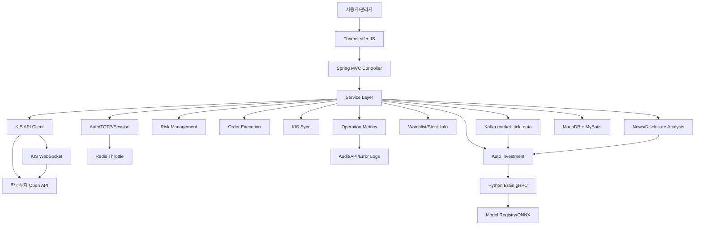
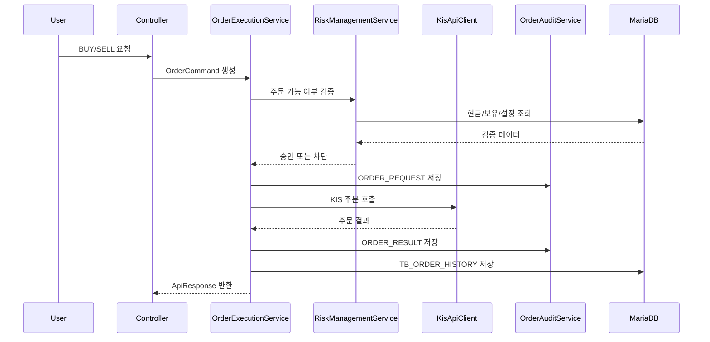
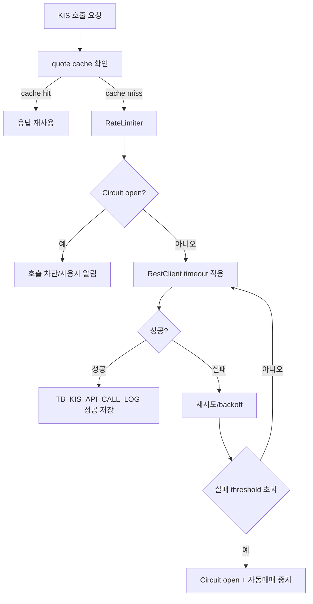
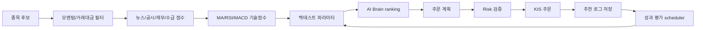

# ZEST AI Trader Backend

| 항목 | 내용 |
| --- | --- |
| 문서 버전 | v2026.07.03 |
| 기준 코드 | 현재 로컬 구현 기준 |
| 최신 반영 | KIS REST/WebSocket, 상위 3개 전략 자동주문, Kafka tick pipeline, 캔들 백필/정리 운영 API, 뉴스/공시 분석, 관심종목, 시장 캘린더, Python Brain/MLOps scheduler, 주문/관리자 감사 hash chain |

## 3초 안에 기술적 가치 증명하기

### 🧠 AI 판단과 증권사 주문을 분리한 리스크 중심 자동매매 백엔드


> 단순 주문 API 호출이 아니라, 사용자별 KIS 설정, 주문 전 리스크 검증, 시장 캘린더, 호출 제한, circuit breaker, 감사 로그, 자동정지까지 하나의 거래 백엔드로 묶었습니다.
> AI 추론은 Python Brain에 위임하고, 주문·계좌·보안·트랜잭션은 Java Core가 책임지도록 장애 경계를 나눴습니다.
> 한국투자 Open API의 rate limit과 장애를 백엔드 레벨에서 흡수하고, 성과 기반 상위 3개 전략이 평가자산 70% 한도 안에서 자동주문하도록 설계했습니다.

[Live Demo](http://localhost:8090/auth) · [메인 README](README.md) · [프론트엔드 문서](README_FE.md) · [보안 문서](README_SE.md)

## Getting Started

### 요구 사항

| 항목 | 버전/값 |
| --- | --- |
| Java target | 17 |
| Gradle JVM | JDK 21 권장 |
| Spring Boot | 3.5.11 |
| DB | local 기본값, dev/prod MariaDB |
| Python Brain | Python 3.13.x |
| Port | `8090` |

### Java Core 실행

```bash
./gradlew bootRun
```

### 로컬 단독 실행 패키지

```bash
cd /Users/namgukang/Documents/dev/zest-ai-trader-local
./run-zest.command
```

단독 실행 패키지는 jar, Python Brain, proto, storage, 내장 H2 파일 DB 기본값을 포함한다. 운영 DB/KIS key는 `.env`로만 주입하고 패키지에 포함하지 않는다.

### 테스트

```bash
./gradlew test
```

### MariaDB/KIS 환경 변수 예시

```bash
export ZEST_DB_URL="jdbc:mariadb://DB_HOST:3306/aitrader"
export ZEST_DB_USERNAME="..."
export ZEST_DB_PASSWORD="..."
export KIS_APP_KEY="..."
export KIS_APP_SECRET="..."
export KIS_ACCOUNT_NO="12345678"
export KIS_ACCOUNT_PRODUCT_CODE="01"
./gradlew bootRun --args='--spring.profiles.active=dev --zest.kis.enabled=true --zest.kis.environment=paper'
```

자동주문은 별도 안전장치입니다.

```bash
./gradlew bootRun --args='--zest.kis.enabled=true --zest.trading.auto-trading-enabled=true'
```

## 전체 아키텍처



## 패키지 책임

| 패키지 | 책임 |
| --- | --- |
| `auth` | 회원가입, 이메일 인증, 로그인, TOTP, 실패 제한 |
| `kis` | 사용자별 KIS 설정, 토큰, 현재가, 주문, 호출 제한, WebSocket 실시간 수신 |
| `trading` | 주문 실행, tick/candle, Kafka consumer, pending 재주문, 일봉/분봉 백필 |
| `risk` | 현금, 미수, 일손실, 집중도, 주문 가능 여부 |
| `autoinvest` | 자동 추천, 전략 매칭, 상위 3개 전략 주문 계획, 결과 평가 |
| `sync` | 잔고, 보유, 주문/체결 동기화 |
| `operation` | 운영 로그, KIS latency, 주문 실패율, 재주문 횟수, Kafka lag, 캔들 수집 운영 |
| `security` | 민감정보 암호화/마스킹 |
| `ai` | Python Brain gRPC client, 자동 학습 scheduler, 모델 registry 연동 |
| `audit` | 주문/관리자 행위 감사와 hash chain |
| `market` | 종목 정보, 시장 캘린더, 주문 미리보기/확정 |
| `watchlist` | 사용자별 관심종목 그룹과 종목 관리 |
| `news` | RSS/네이버 뉴스/DART 공시 수집과 감성/영향도 분석 |

## 주문 처리 시퀀스



## 외부 API 안정화



현재 기본값은 보수적으로 설정되어 있습니다.

| 설정 | 기본값 |
| --- | --- |
| 모의투자 호출량 | `0.8 permits/sec` |
| 실전투자 호출량 | `15 permits/sec` |
| 연결 timeout | `3000ms` |
| 읽기 timeout | `5000ms` |
| circuit breaker 실패 기준 | `3회` |
| circuit breaker open 시간 | `30000ms` |
| quote cache | `30000ms` |

## 자동추천/자동주문 흐름



## 트러블슈팅과 Trade-off

### 1. KIS 초당 거래건수 초과

| STAR | 내용 |
| --- | --- |
| Situation | 모의투자 API에서 `EGW00201` 초당 거래건수 초과 오류가 발생했습니다. |
| Task | 자동매매가 같은 endpoint를 반복 호출해 장애를 키우지 않도록 제한해야 했습니다. |
| Action | `RateLimiter`, 최근 60초 호출량 로그, quote cache, circuit breaker를 함께 적용했습니다. |
| Result | 호출량을 설정값 안으로 제한하고, 장애 시 사용자 알림과 자동매매 강제 중지로 확산을 막았습니다. |

### 2. JPA 대신 MyBatis

| 선택지 | 장점 | 한계 |
| --- | --- | --- |
| JPA | 도메인 모델링 생산성 | 복잡한 감사/집계 SQL 추적 난도 증가 |
| MyBatis | SQL 가시성, 운영 대응력 | 반복 SQL 관리 필요 |

금융/감사 로그 중심 프로젝트라 실제 SQL 통제력과 쿼리 리뷰 가능성을 우선해 MyBatis를 선택했습니다.

### 3. Pending 주문 재주문

PENDING 주문은 무조건 재주문하면 중복 주문이 될 수 있습니다. 그래서 재주문 전 KIS 체결 상태를 확인하고, 사용자가 취소하거나 체결 완료될 때까지 설정된 조건 안에서만 재시도하도록 설계했습니다.

## 운영 지표

| 지표 | 목적 |
| --- | --- |
| KIS latency | 외부 API 장애/지연 탐지 |
| 추천 실행 시간 | 자동추천 병목 확인 |
| 주문 실패율 | 주문 API/리스크 정책 이상 탐지 |
| 재주문 횟수 | PENDING 반복과 중복 주문 위험 확인 |
| API 호출량 | 한국투자 rate limit 초과 방지 |
| WebSocket/REST reconciliation | 실시간 체결 이벤트와 REST 체결 조회 차이 확인 |
| Kafka lag/DLQ | tick 파이프라인 지연과 실패 이벤트 확인 |
| 캔들 백필 상태 | 일봉/분봉 누락 구간과 실패 재시도 대상 확인 |

## Issue & PR 운영 규칙

```text
feat(backend): KIS circuit breaker 적용
fix(order): PENDING 재주문 전 체결 상태 확인
refactor(kis): quote cache와 batch 조회 분리
test(risk): 미수 가능 주문 한도 검증 케이스 추가
docs(backend): 운영 지표와 장애 대응 흐름 문서화
```

PR 템플릿에는 아래를 포함합니다.

| 항목 | 설명 |
| --- | --- |
| 변경 이유 | 어떤 장애나 요구사항을 해결하는지 |
| 설계 선택 | 선택지와 trade-off |
| 테스트 | unit/integration/manual test |
| 운영 영향 | DB migration, config, rate limit 변경 여부 |
| rollback | 기능 flag 또는 설정 복구 방법 |

## 면접에서 말할 포인트

- "AI 모델은 Python으로 실험하고, 주문 안정성은 Java에서 책임지도록 경계를 나눴습니다."
- "외부 API 장애는 재시도만으로 해결하지 않고 rate limit, timeout, circuit breaker, 자동정지를 같이 설계했습니다."
- "금융 도메인에서는 주문 요청과 결과를 감사 로그로 남겨 사후 추적성을 확보하는 것이 핵심이라고 봤습니다."
- "자동추천은 결과를 저장하고 평가해서 다음 파라미터에 반영하는 폐루프 구조로 설계했습니다."
- "시세/체결은 WebSocket 실시간 수신과 REST 동기화를 분리하고, 운영 화면에서 reconciliation과 Kafka lag를 확인하게 했습니다."
