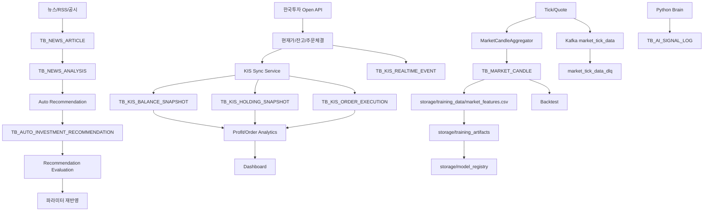
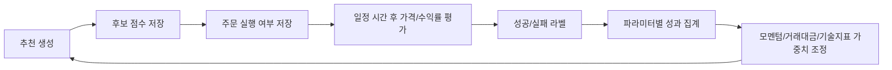
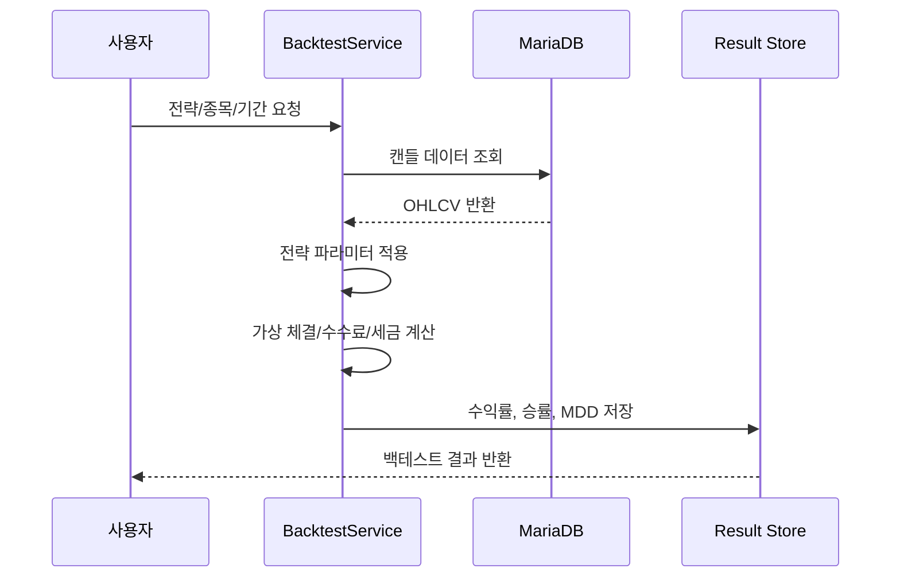

# ZEST AI Trader Data

| 항목 | 내용 |
| --- | --- |
| 문서 버전 | v2026.07.03 |
| 기준 코드 | 현재 로컬 구현 기준 |
| 최신 반영 | 시장 캘린더, 뉴스/공시 분석, 캔들 백데이터/누락 관리, feature CSV 자동 생성, model registry, 전략별 성과/비중 조정, KIS WebSocket REST reconciliation, Kafka DLQ/lag, 감사 데이터 |

## 3초 안에 기술적 가치 증명하기

### 📊 주문·시세·AI 판단 로그를 성과 평가와 재학습 데이터로 되돌리는 투자 데이터 파이프라인


> 이 프로젝트의 데이터 설계는 "저장"이 아니라 "판단 근거와 결과를 다시 평가하는 루프"에 집중했습니다.
> 현재가, 잔고, 체결, 추천, 뉴스/공시, 백테스트, 리스크 이벤트를 분리 저장해 전략 성과와 장애 원인을 함께 분석할 수 있게 했습니다.
> 캔들 백데이터와 거래 결과를 feature CSV로 바꾸고, 자동 학습 artifact와 model registry로 되돌려 다음 추천/주문에 반영하는 데이터 루프를 구성했습니다.

[Live Demo](http://localhost:8090/auth) · [메인 README](README.md) · [백엔드 문서](README_BE.md) · [보안 문서](README_SE.md)

## Getting Started

### DB 백업

```bash
export ZEST_DB_HOST="DB_HOST"
export ZEST_DB_PORT="3306"
export ZEST_DB_NAME="aitrader"
export ZEST_DB_USERNAME="..."
export ZEST_DB_PASSWORD="..."
export ZEST_BACKUP_DIR="./backup"
./scripts/backup_db.sh
```

### 로컬 실행 후 데이터 확인

```bash
./gradlew bootRun
curl http://localhost:8090/api/status
curl http://localhost:8090/api/kis/status
```

### MLOps 산출물 확인

```bash
find storage/training_artifacts -maxdepth 2 -type f
find storage/model_registry -maxdepth 2 -type f
```

### 주요 SQL 자산

| 파일 | 역할 |
| --- | --- |
| `src/main/resources/schema.sql` | 핵심 테이블 정의 |
| `src/main/resources/mapper/sql/**/*.xml` | MyBatis 조회/적재 SQL |
| `src/main/resources/sql/20260601_fix_trade_fee_policy_charset.sql` | 수수료 정책 한글/문자셋 복구 |
| `src/main/resources/sql/20260701_market_calendar_2026_2035_seed.sql` | 2026~2035 한국장 휴장일/장마감 캘린더 seed |
| `scripts/backup_db.sh` | MariaDB 백업 |
| `scripts/restore_db.sh` | MariaDB 복구 |

## 데이터 파이프라인



## 주요 ERD

```mermaid
erDiagram
    TB_USER_ACCOUNT ||--o{ TB_USER_KIS_CONFIG : "사용자별 KIS 설정"
    TB_USER_ACCOUNT ||--o{ TB_KIS_BALANCE_SNAPSHOT : "잔고 스냅샷"
    TB_USER_ACCOUNT ||--o{ TB_KIS_HOLDING_SNAPSHOT : "보유 스냅샷"
    TB_USER_ACCOUNT ||--o{ TB_KIS_ORDER_EXECUTION : "주문/체결"
    TB_USER_ACCOUNT ||--o{ TB_KIS_REALTIME_EVENT : "실시간 이벤트"
    TB_USER_ACCOUNT ||--o{ TB_ORDER_HISTORY : "주문 이력"
    TB_USER_ACCOUNT ||--o{ TB_AUTO_INVESTMENT_RECOMMENDATION : "추천 로그"
    TB_STOCK_INFO ||--o{ TB_MARKET_CANDLE : "캔들"
    TB_STOCK_INFO ||--o{ TB_NEWS_ARTICLE : "뉴스/공시"
    TB_STOCK_INFO ||--o{ TB_USER_TICKER_LOCK : "종목별 잠금"
    TB_WATCHLIST_GROUP ||--o{ TB_WATCHLIST_ITEM : "관심종목"
    TB_VIRTUAL_ACCOUNT ||--o{ TB_ORDER_HISTORY : "전략 주문"
    TB_VIRTUAL_ACCOUNT ||--o{ TB_VIRTUAL_HOLDING : "전략 보유"
```



## 데이터 모델링 Best Practice

| 영역 | 설계 |
| --- | --- |
| 시장 데이터 | raw tick 전체 저장보다 OHLCV candle 집계 우선 |
| 주문 데이터 | 주문 요청, KIS 주문/체결, 감사 로그를 분리 |
| 추천 데이터 | 후보 점수, 주문 계획, 성공 여부를 로그로 저장 |
| 뉴스 데이터 | 기사/공시 원문과 분석 결과를 분리해 재분석과 점수 조정을 가능하게 함 |
| 성과 데이터 | 실현손익, 평가손익, 수수료, 세금을 분리 계산 |
| 보안 데이터 | 인증 실패, API 호출, 자동정지 로그를 별도 테이블로 저장 |
| 문자 데이터 | 전체 테이블/문자열 컬럼 `utf8mb4_unicode_ci` 통일 |
| 학습 데이터 | 장마감 feature CSV, training artifact, registry manifest를 버전 단위로 관리 |
| 운영 데이터 | 시장 캘린더, Kafka lag, DLQ, WebSocket/REST reconciliation, 캔들 누락/백필, 주문 감사 hash chain을 운영 분석에 사용 |

## 추천 평가 루프



## 백테스트 데이터 흐름



## 문자셋/한글 데이터 품질

최근 점검 기준:

| 항목 | 결과 |
| --- | --- |
| DB 기본 collation | `utf8mb4_unicode_ci` |
| 테이블 | 33개 모두 `utf8mb4_unicode_ci` |
| 문자열 컬럼 | 128개 모두 `utf8mb4_unicode_ci` |
| 문자열 인덱스 길이 초과 | 0건 |
| UNIQUE/PRIMARY 충돌 위험 | 0건 |
| 바이너리 mojibake 후보 | 0건 |
| 복구 확인 | `tb_trade_fee_policy.POLICY_NAME = 기본 국내주식 비용 정책` |

## 트러블슈팅과 Trade-off

### 1. 한글 깨짐과 collation 혼재

| STAR | 내용 |
| --- | --- |
| Situation | `tb_trade_fee_policy.policy_name` 값이 mojibake 형태로 보였습니다. |
| Task | 기존 데이터를 손상하지 않고 전체 문자열 컬럼의 문자셋/정렬 규칙을 통일해야 했습니다. |
| Action | 현황 조회, 깨진 후보 탐지, 인덱스/UNIQUE 점검, 백업 스키마 생성, 테이블 단위 순차 변환, 별도 UPDATE 복구 순서로 진행했습니다. |
| Result | DB/33개 테이블/128개 문자열 컬럼을 `utf8mb4_unicode_ci`로 통일하고 깨진 후보 0건을 확인했습니다. |

### 2. raw tick 저장 vs candle aggregation

| 선택지 | 장점 | 한계 |
| --- | --- | --- |
| raw tick 전체 저장 | 재현성 높음 | 저장 비용과 조회 비용 증가 |
| candle 집계 저장 | 차트/백테스트 조회 효율 | microstructure 분석 한계 |

현재 서비스 목적은 사용자 화면, 백테스트, 전략 평가이므로 candle aggregation을 우선했습니다. raw tick은 향후 feature store 또는 cold storage로 분리하는 방향이 적합합니다.

### 3. 원문 API 응답 저장

원문 응답은 장애 분석에 유용하지만 민감정보 노출 위험이 있습니다. 그래서 필요한 경우에만 저장하고, 계좌/API key 계열 값은 마스킹 정책을 거친 뒤 로그에 남기는 방향으로 설계했습니다.

## 데이터 검증 체크리스트

| 검증 | SQL/방법 |
| --- | --- |
| 테이블 collation | `information_schema.TABLES` |
| 컬럼 collation | `information_schema.COLUMNS` |
| UNIQUE 충돌 | target collation으로 `GROUP BY ... HAVING COUNT(*) > 1` |
| 백업 row count | 원본/백업 스키마 테이블별 count 비교 |
| 깨진 문자 후보 | `COLLATE utf8mb4_bin LIKE` 기반 바이너리 검사 |
| 수익률 검증 | 주문 체결, 보유 스냅샷, 수수료 정책 cross-check |
| 캔들 누락 검증 | 시장 캘린더와 TB_MARKET_CANDLE 수집 target 비교 |
| WebSocket 검증 | TB_KIS_REALTIME_EVENT와 TB_KIS_ORDER_EXECUTION reconciliation |

## Issue & PR 운영 규칙

```text
feat(data): 추천 평가 로그 테이블 추가
fix(data): 수수료 정책명 한글 깨짐 복구
migration(data): 전체 문자열 컬럼 utf8mb4_unicode_ci 변환
perf(data): 캔들 조회 인덱스 추가
docs(data): 백업/복구 절차 문서화
```

PR에는 migration 전후 row count, rollback 방법, 인덱스 영향, 샘플 검증 SQL을 포함합니다.

## 면접에서 말할 포인트

- "데이터를 많이 저장하는 것보다 의사결정과 사후 평가가 가능한 형태로 저장하는 데 집중했습니다."
- "추천 결과를 저장하고 평가해서 다시 파라미터에 반영하는 폐루프를 만들었습니다."
- "한글 깨짐 문제는 단일 UPDATE가 아니라 DB/테이블/컬럼/인덱스/백업을 포함한 migration 절차로 해결했습니다."
- "감사 로그는 거래 분석뿐 아니라 보안 이벤트와 외부 API 장애 분석에도 쓰이도록 분리했습니다."
- "뉴스/공시 원문과 분석 결과를 분리해, 같은 기사라도 분석 로직 변경 후 다시 평가할 수 있게 했습니다."
