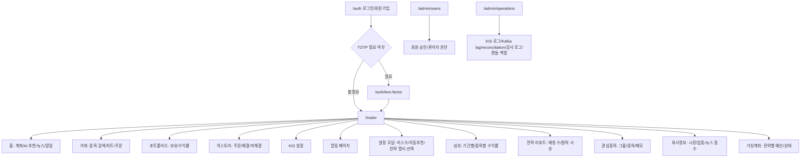
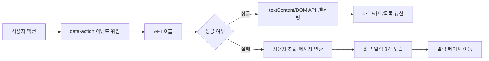
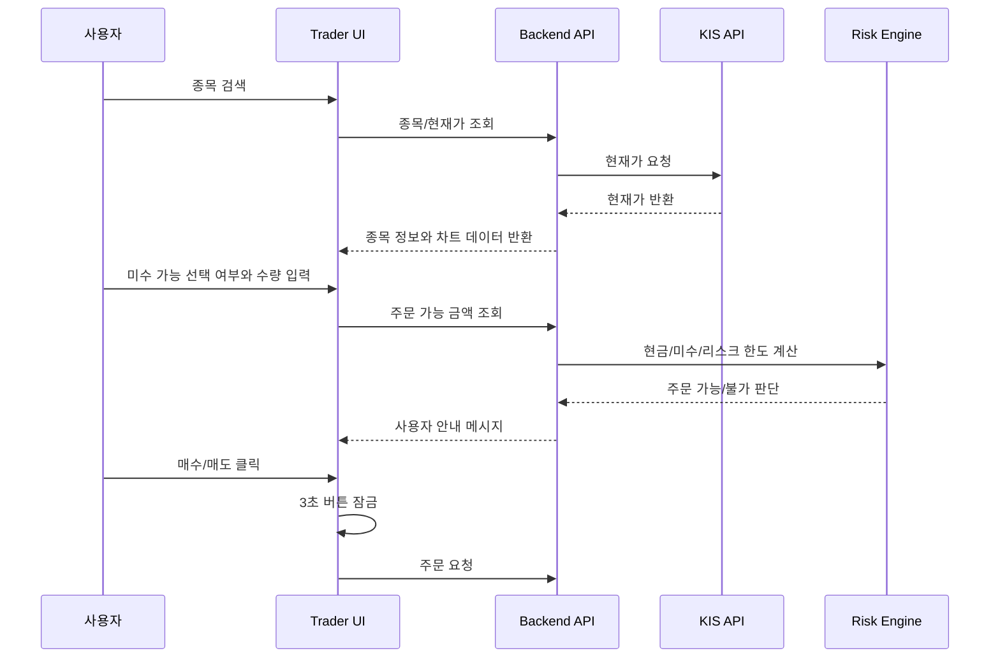

# ZEST AI Trader Frontend

| 항목 | 내용 |
| --- | --- |
| 문서 버전 | v2026.07.03 |
| 기준 코드 | 현재 로컬 구현 기준 |
| 최신 반영 | 전략 멀티 선택, 자동추천/자동주문 분리, 관심종목/회사정보 화면, KIS WebSocket 상태, 알림/거래내역 pagination, 기간/종목 수익률 화면, 캔들 백필 운영 대시보드 |

## 3초 안에 기술적 가치 증명하기

### 🧭 실수 비용이 큰 주식 주문 화면을 안전하게 조작하도록 설계한 트레이딩 UX


> ZEST AI Trader의 프론트엔드는 "예쁜 대시보드"보다 "사용자가 실수하지 않는 주문 경험"에 집중했습니다.
> 한국투자 API 설정, 미수 가능, 자동매매, 주문 취소, 리스크 알림처럼 손실로 이어질 수 있는 액션을 상태 배지, 안내 문구, 버튼 잠금, 권한 흐름으로 방어했습니다.
> 전략 멀티 선택, 자동추천/자동주문 분리, 관심종목과 회사정보, 최근 3개 알림 요약과 전체 알림 페이지, 기간/종목별 수익률 화면을 통해 자동매매 상태를 사용자가 추적할 수 있게 했습니다.

[Live Demo](http://localhost:8090/auth) · [메인 README](README.md) · [백엔드 문서](README_BE.md) · [보안 문서](README_SE.md)

## Getting Started

### 요구 사항

| 항목 | 버전/값 |
| --- | --- |
| Java | 17 target, Gradle 실행 JVM은 JDK 21 권장 |
| Spring Boot | 3.5.11 |
| 포트 | `8090` |
| 기본 프로필 | `local` |
| 화면 진입 | `/auth` 로그인 후 `/trader` |

### 1분 실행

```bash
./gradlew bootRun
```

브라우저에서 `http://localhost:8090/auth`에 접속합니다.

단독 실행 패키지를 사용할 때는 아래처럼 실행합니다.

```bash
cd /Users/namgukang/Documents/dev/zest-ai-trader-local
./run-zest.command
```

한국투자 모의투자 연결까지 확인하려면 환경 변수를 주입합니다.

```bash
export KIS_APP_KEY="..."
export KIS_APP_SECRET="..."
export KIS_ACCOUNT_NO="12345678"
export KIS_ACCOUNT_PRODUCT_CODE="01"
./gradlew bootRun --args='--zest.kis.enabled=true --zest.kis.environment=paper'
```

프론트 정적 스크립트 문법 검사는 아래처럼 수행합니다.

```bash
node --check src/main/resources/static/js/trader.js
node --check src/main/resources/static/js/admin/users.js
node --check src/main/resources/static/js/admin/operations.js
node --check src/main/resources/static/js/auth/two-factor.js
```

## 화면 아키텍처



## 상태 관리 흐름



## 핵심 UX Best Practice

| 원칙 | 적용 |
| --- | --- |
| 위험 액션은 명시적으로 | 실주문, 자동매매, 미수 가능을 별도 체크/토글로 분리 |
| 한 번 클릭은 한 번만 처리 | 주요 버튼 클릭 후 3초 비활성화로 중복 터치 방어 |
| 오류 원문은 사용자 언어로 | KIS `500`, `EGW00201` 같은 원문을 안내 메시지로 변환 |
| 데이터는 필요한 만큼만 | 홈 알림은 최근 3개만 표시하고 전체 알림은 별도 페이지로 분리 |
| DOM XSS 방어 | 주문 버튼과 메시지 렌더링에서 `innerHTML`, inline handler 제거 |
| 고위험 옵션은 박스 안에서 설명 | "미수 가능" 체크박스 영역 안에 손실 위험 안내 문구 배치 |
| 자동화 상태는 분리해서 표시 | 자동추천 적용, 자동주문 실행, 선택 종목 자동 운용을 각각 다른 토글로 노출 |
| 전략은 멀티 선택 | 단일 select가 아니라 공통코드 기반 전략 목록을 체크박스로 다중 선택 |
| 반복 탐색은 그룹화 | 관심종목 그룹, 종목 메모, 회사정보를 분리해 검색과 주문 사이의 맥락을 유지 |
| 운영 작업은 진행 상태 표시 | 캔들 백필/정리/누락 조회처럼 오래 걸릴 수 있는 작업은 관리자 화면에서 상태와 재시도를 분리 |

## 대표 화면 흐름



## 트러블슈팅과 의사결정

### 1. KIS 원문 오류가 사용자 화면에 그대로 노출됨

| STAR | 내용 |
| --- | --- |
| Situation | 한국투자 API 장애 시 `500 Internal Server Error`와 JSON 원문이 사용자 화면에 그대로 보였습니다. |
| Task | 사용자가 이해할 수 있는 문장으로 바꾸되, 운영 분석용 원문은 잃지 않아야 했습니다. |
| Action | 화면 메시지는 별도 변환하고, 원문은 KIS/API 로그와 운영 화면에서 확인하도록 분리했습니다. |
| Result | 사용자는 "자동매매가 중지된 이유"를 읽고, 운영자는 원문 코드로 원인을 추적할 수 있게 됐습니다. |

### 2. `innerHTML` 기반 렌더링의 보안 리스크

| 대안 | 장점 | 한계 | 선택 |
| --- | --- | --- | --- |
| `innerHTML` 유지 | 빠른 구현 | XSS와 inline event handler 위험 | 제외 |
| sanitizer 도입 | 기존 구조 유지 가능 | 의존성/정책 관리 필요 | 보류 |
| DOM API 렌더링 | 텍스트와 이벤트를 명확히 분리 | 리팩터링 비용 | 선택 |

결과적으로 주요 사용자 메시지, 주문 버튼, 관리자 화면, 2차 인증 화면에서 `textContent`, `createElement`, `data-action` 패턴으로 정리했습니다.

### 3. 알림 노출 개수

홈 화면에 모든 알림을 보여주면 주문 판단 영역이 밀렸습니다. 최근 3개만 홈에 노출하고, 전체 이력은 별도 알림 페이지로 이동시켜 정보 밀도와 탐색성을 분리했습니다.

## 측정/검증 체크리스트

| 항목 | 기준 |
| --- | --- |
| 문법 검사 | `node --check` 대상 JS 통과 |
| 중복 클릭 방어 | 주문/저장 버튼 클릭 후 3초간 재클릭 불가 |
| 보안 렌더링 | `innerHTML`, inline `onclick`, `javascript:` 검색 0건 유지 |
| 모바일 사용성 | 하단 탭, 카드, 버튼 텍스트 겹침 없음 |
| 오류 메시지 | KIS 원문 JSON 대신 사용자 친화 문장 노출 |
| 화면 범위 | `/auth`, `/auth/two-factor`, `/trader`, `/admin/users`, `/admin/operations` 수동 점검 |
| 운영 대시보드 | Kafka lag, WebSocket reconciliation, audit archive, candle backfill 상태 확인 |

## Issue & PR 운영 규칙

```text
feat(frontend): 알림 페이지 추가
fix(frontend): KIS 오류 메시지 사용자 안내 문구로 변환
refactor(frontend): trader 렌더러를 DOM API 기반으로 교체
test(frontend): trader.js 문법 검사와 브라우저 회귀 점검
```

PR에는 아래 항목을 남깁니다.

| 항목 | 예시 |
| --- | --- |
| Why | 사용자가 API 원문 오류를 이미지처럼 읽는 문제를 줄이기 위해 |
| What | 알림 렌더러, 오류 메시지 변환, 버튼 잠금 추가 |
| Test | `node --check`, `/auth` 로그인, `/trader` 주문 화면 수동 점검 |
| Risk | 실제 주문 액션에 연결되므로 dry-run 또는 모의투자에서 먼저 검증 |

## 면접에서 말할 포인트

- "트레이딩 UI는 예쁘게 보이는 것보다 오조작을 막는 구조가 먼저라고 판단했습니다."
- "사용자 메시지는 `textContent`로 처리하고, 이벤트는 `data-action` 위임으로 모아 DOM XSS 표면을 줄였습니다."
- "홈 알림은 최근 3개로 제한하고 전체 알림 페이지를 분리해 반복 사용자의 정보 밀도를 조절했습니다."
- "KIS 코드값과 위험 옵션은 사용자가 외우지 않아도 되도록 select, tooltip, 안내 문구로 풀었습니다."
- "관심종목, 회사정보, 뉴스 점수, 주문 화면을 분리해 사용자가 종목을 고르고 주문하기까지의 판단 흐름을 유지했습니다."
