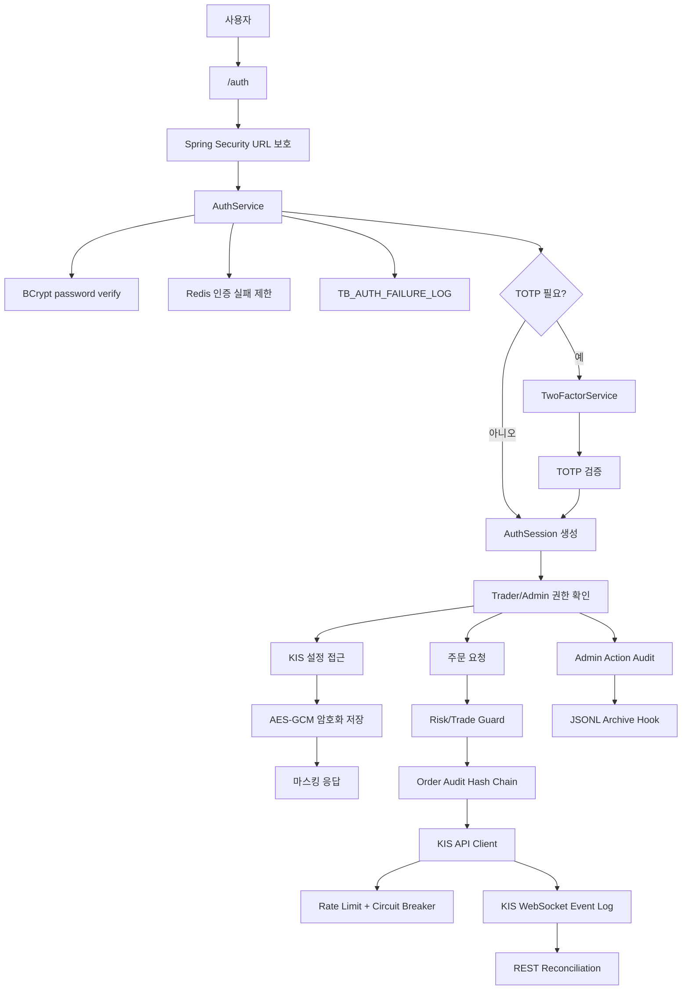
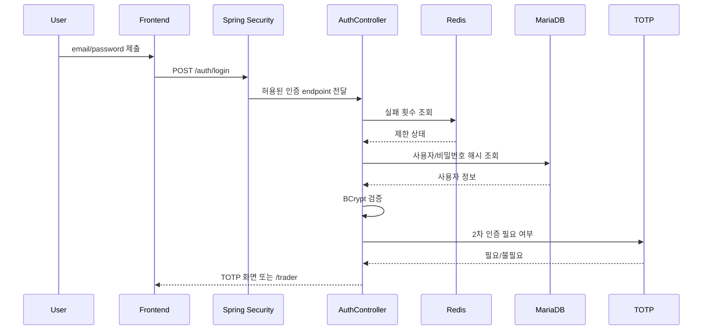
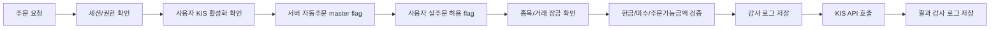
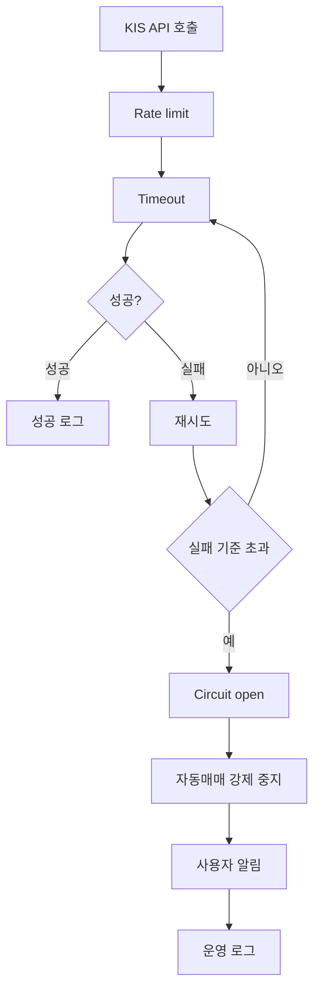

# ZEST AI Trader Security

| 항목 | 내용 |
| --- | --- |
| 문서 버전 | v2026.07.03 |
| 기준 코드 | 현재 로컬 구현 기준 |
| 최신 반영 | Spring Security URL/role 보호, TRADER+ADMIN 동시 권한, CSRF/2FA/CSP, 민감정보 마스킹, KIS WebSocket/REST 운영 점검, 주문/관리자 감사 hash chain, OSV scan, JSONL archive 외부 보관소 hook |

## 3초 안에 기술적 가치 증명하기

### 🔐 실제 계좌·API Key·자동주문을 다루는 투자 시스템에 다층 방어를 적용한 보안 설계


> ZEST AI Trader는 로그인 보안만이 아니라 "주문 사고 방지"까지 보안 범위로 봅니다.
> 한국투자 API key, secret, 계좌번호, HTS ID를 암호화/마스킹하고, 권한 없는 주문·중복 주문·외부 API 장애 중 반복 호출과 실시간 수신 불일치를 방어합니다.
> Spring Security URL 보호, TRADER+ADMIN 동시 역할, CSRF, CSP, TOTP, Redis 인증 제한, 감사 hash chain, KMS secret 외부화를 함께 적용했습니다.

[Live Demo](http://localhost:8090/auth) · [메인 README](README.md) · [프론트엔드 문서](README_FE.md) · [백엔드 문서](README_BE.md)

## Getting Started

### 보안 기본값

| 설정 | 기본값/정책 |
| --- | --- |
| KIS 연동 | `zest.kis.enabled=false` |
| 자동주문 | `zest.trading.auto-trading-enabled=false` |
| 세션 쿠키 | `HttpOnly`, `SameSite=Strict` |
| Actuator 노출 | `health`만 |
| 2차 인증 강제 | 환경 변수로 제어 |
| 운영 DB 비밀번호 | KMS ciphertext 주입 권장 |
| 감사 로그 | 주문/관리자 행위 hash chain |
| 취약점 점검 | OSV scanner CI 기준 |
| 실시간 수신 | WebSocket 이벤트 저장 후 REST 체결 내역과 reconciliation |

### 로컬 실행

```bash
./gradlew bootRun
```

### 보안 점검 명령

```bash
rg -n "<script(?![^>]*src)|onclick=|onchange=|innerHTML|th:onclick|javascript:" src/main/resources/templates src/main/resources/static/js --pcre2
./gradlew test
node --check src/main/resources/static/js/trader.js
```

### 운영 secret 예시

```bash
export ZEST_SECRET_MASTER_KEY="base64-or-strong-random-key"
export ZEST_DB_PASSWORD_KMS_CIPHERTEXT="..."
export ZEST_TWO_FACTOR_REQUIRED="true"
export SESSION_COOKIE_SECURE="true"
```

## 보안 아키텍처



## 인증/인가 시퀀스



## 보호 대상과 통제

| 보호 대상 | 저장 | 응답/화면 | 추가 통제 |
| --- | --- | --- | --- |
| 비밀번호 | BCrypt hash | 노출 없음 | 로그인 실패 제한 |
| TOTP secret | AES-GCM | 등록 시에만 QR/secret | 2차 인증 실패 제한 |
| KIS App Key | AES-GCM | 부분 마스킹 | 사용자별 권한 확인 |
| KIS App Secret | AES-GCM | 표시하지 않음 | 저장 시에만 갱신 |
| 계좌번호 | AES-GCM | 마스킹 | 주문 가능 금액 조회 시 서버 검증 |
| DB 비밀번호 | KMS ciphertext 권장 | 노출 없음 | dev/prod profile 외부화 |
| 주문 요청 | 감사 로그 | 사용자 결과 메시지 | Risk guard, auto stop |
| WebSocket 원문 이벤트 | 원문 이벤트 로그 | 운영 화면 집계 | REST 체결 내역과 대조 |
| 뉴스/공시 원문 | 수집 원문/분석 결과 분리 | 요약/점수만 노출 | 외부 텍스트는 주문 전 RMS를 우회하지 못함 |

## 주문 보안 흐름



## 외부 API 장애 보안

외부 API 장애는 단순 장애가 아니라 반복 주문과 과다 호출로 이어질 수 있는 보안/안전 이슈입니다.



## 트러블슈팅과 Trade-off

### 1. 관리자/트레이더 URL 보호

| STAR | 내용 |
| --- | --- |
| Situation | 인터셉터만으로 화면 접근을 제어하면 Spring Security 레벨의 URL 보호가 느슨해질 수 있었습니다. |
| Task | `/admin/**`, `/trader/**`, `/api/**` 접근을 세션 권한에 맞게 정리해야 했습니다. |
| Action | SecurityConfig에서 URL/role 보호를 먼저 적용하고, 화면별 세션 조건을 명확히 분리했습니다. |
| Result | 인증 전 접근, trader 미승인 사용자 접근, 일반 사용자의 관리자 접근을 더 앞단에서 차단하게 됐습니다. |

### 2. Redis 인증 제한과 fallback

| 선택지 | 장점 | 한계 |
| --- | --- | --- |
| DB count | 영속성 | 매 로그인마다 DB 부하 |
| Redis | 다중 서버 공유, TTL 처리 쉬움 | Redis 장애 영향 |
| In-memory | 장애 fallback | 다중 서버 공유 불가 |

Redis를 기본으로 사용하고 장애 시 인메모리 제한으로 전환해 보안성과 가용성 사이의 균형을 잡았습니다.

### 3. CSP와 inline handler 제거

inline `onclick`, `innerHTML` 기반 UI는 XSS와 CSP 강화의 장애물이 됩니다. 그래서 이벤트는 `data-action` 기반 위임으로 모으고, 메시지는 `textContent` 중심으로 처리했습니다.

## 보안 점검 체크리스트

| 항목 | 기준 |
| --- | --- |
| URL 보호 | `/admin/**`, `/trader/**`, `/api/**` 권한 확인 |
| CSRF | 상태 변경 요청 token 검증 |
| CSP | inline script/event handler 제거 |
| 인증 제한 | 로그인 5회 실패 차단, TOTP 실패 제한 |
| Secret 저장 | KIS/계좌/TOTP secret AES-GCM |
| Secret 응답 | API key/account masking |
| DB secret | dev/prod KMS ciphertext 주입 |
| 주문 감사 | 요청/결과/취소/정정 로그 |
| API 장애 | timeout, retry, circuit breaker, auto stop |
| 실시간 수신 | WebSocket 원문과 REST 체결 reconciliation |
| 운영 작업 | 캔들 백필/정리 API는 관리자 권한으로 제한 |
| 로그 | 비밀번호/TOTP/API secret 원문 저장 금지 |

## Issue & PR 운영 규칙

```text
feat(security): TOTP 2차 인증 설정 추가
fix(security): 관리자 API role 보호 강화
refactor(security): inline event handler 제거
chore(security): DB secret KMS 외부화
docs(security): 보안 점검 결과와 남은 위험 기록
```

보안 PR에는 아래를 반드시 기록합니다.

| 항목 | 설명 |
| --- | --- |
| Threat | 어떤 위협을 줄이는지 |
| Control | 적용한 보안 통제 |
| Residual Risk | 남은 위험 |
| Verification | 테스트/수동 점검/검색 명령 |
| Rollback | 장애 시 되돌릴 설정 |

## 면접에서 말할 포인트

- "이 프로젝트에서 보안은 로그인 기능이 아니라 주문 사고 방지까지 포함하는 범위로 봤습니다."
- "외부 API 장애가 반복 주문으로 이어질 수 있어 timeout, circuit breaker, 자동정지를 함께 적용했습니다."
- "민감정보는 암호화 저장과 마스킹 응답을 분리해 DB 유출과 화면 노출을 모두 고려했습니다."
- "Redis 인증 제한은 다중 서버 확장성을 고려했고, 장애 시 fallback으로 가용성도 챙겼습니다."
- "CSP를 강화하려면 프론트 코드 구조도 바뀌어야 해서 inline handler와 `innerHTML` 제거를 함께 진행했습니다."
- "실시간 WebSocket 이벤트는 주문 원장으로 바로 믿지 않고, REST 체결 동기화와 대조해 운영자가 차이를 확인하도록 했습니다."
