# ZEST AI Trader 아키텍처

| 항목 | 내용 |
| --- | --- |
| 문서 버전 | v2026.06.12 |
| 기준 코드 | 현재 로컬 구현 기준 |
| 갱신 범위 | 자동추천/자동주문, KIS REST/WebSocket, Kafka 틱 파이프라인, Python Brain/MLOps, 보안/운영, 로컬 단독 실행 패키지 |

<!--
  이 문서는 ZEST AI Trader의 최신 구조를 설명한다.
  README가 빠른 소개라면, 이 문서는 각 모듈의 책임, 데이터 흐름, DB 경계, 보안/운영 상태를 상세히 정리한다.
-->

## 0. 현재 구현 현황

현재 구현은 단순 모의투자 화면을 넘어, 자동 추천부터 주문, 체결 동기화, 성과 평가, 모델 학습, 운영 감사까지 이어지는 자동매매 운영 루프를 목표로 한다.

| 영역 | 현재 구현 상태 |
| --- | --- |
| 자동추천/자동주문 | 성과 기반 상위 3개 전략을 선택하고, 전체 평가자산의 70% 운용 한도를 1/3씩 나누어 신규 매수 후보를 산정한다. 사용자는 자동추천 적용과 자동주문 실행을 분리해 켤 수 있다. |
| 전략 | `SCALPING`, `MOMENTUM_BREAKOUT`, `RSI_REVERSAL`, `MACD_TREND`, `TECHNICAL_CONFLUENCE`, `OPEN_PRICE_RECLAIM`, `OPENING_RANGE_90`, `LEADING_STOCK_TOPDOWN`, `MORNING_FOREIGNER_FLOW`, `RL_PORTFOLIO`를 공통코드/전략 enum/설정 API 흐름에 반영했다. |
| 캔들 주기 | `SCALPING`, `OPENING_RANGE_90`, `MORNING_FOREIGNER_FLOW`는 장중 단기 캔들 중심으로 평가하고, 나머지 전략은 일봉 중심으로 평가한다. |
| 리스크 | 원금 70% 운용, 30% 비상 유보, 기본 손절 -2%, 강제 손절 -5%, 목표수익 3% 달성 시 당일 거래 중지, +2% 이후 트레일링 스탑, PENDING 주문 만료/재주문/취소 흐름을 반영했다. |
| KIS REST | 매수/매도, 잔고, 체결, 미체결, 취소/정정, 주문 가능 금액, API 호출 제한, 타임아웃/서킷 브레이커, 장애 시 자동매매 중지 정책을 포함한다. |
| KIS WebSocket | 승인 키, 사용자별 연결/해제/상태, 실시간 체결가/호가 구독, ping/pong, 재연결 대기/흔들림 보정, 원문 저장, 주문번호 우선 대사 기준선을 구현했다. |
| Kafka | `market_tick_data` 생산자/소비자, 직접 큐 대체 경로, `market_tick_data_dlq`, 지연 조회 API/운영 화면, 로컬 Docker Compose와 Amazon Linux 운영 가이드를 포함한다. |
| Python Brain/MLOps | gRPC 계약, Python Brain 자동 기동, 특성값 CSV 생성, CNN/LSTM 및 PPO/SAC 어댑터 학습, ONNX 내보내기/등록, 모델 레지스트리 최신 모델 적재/재적재, shadow 성과 로그를 포함한다. |
| 성과 평가 | 장마감 일별 성과 평가, 추천 점수와 실제 수익률 상관, 전략별 승률/평균수익률/평균보유시간, MDD/손익비/체결 실패율, 다음날 전략 비중 조정 흐름을 구현했다. |
| 보안/감사 | ROLE 조합 접근, 공통코드 기반 값 관리, CSRF/2FA/마스킹/CSP/보안 헤더, 주문 감사 해시 체인, 관리자 행위 감사, JSONL 아카이브 외부 보관소 전송 연결 지점, OSV 의존성 점검 CI를 반영했다. |
| 로컬 단독 실행 | `/Users/namgukang/Documents/dev/zest-ai-trader-local/run-zest.command` 패키지 기준으로 내장 H2 DB, jar, Python Brain, proto, 저장소를 포함한 단독 실행을 검증했다. |

## 1. 아키텍처 요약

ZEST AI Trader는 한국투자증권 Open API 기반 모의투자/자동매매 시스템이다. Java Core 엔진은 사용자 화면, 인증/인가, 주문 실행, 리스크 통제, 한국투자 API 연동, DB 영속화를 담당한다. Python Brain 엔진은 gRPC 기반 AI 판단 엔진으로 분리되어 있으며, 현재는 안정적인 계약과 기본 모델 경계를 제공한다.

핵심 원칙은 다음과 같다.

- Java Core 엔진은 증권사 연결, OMS, RMS, 호출 제한, 영속화, UI를 책임진다.
- Python Brain 엔진은 모델 추론과 전략 라우팅을 책임진다.
- Java와 Python은 Protobuf/gRPC로 통신한다.
- DB 접근은 MyBatis만 사용한다. JPA는 의도적으로 사용하지 않는다.
- 전략별 예산은 `TB_VIRTUAL_ACCOUNT`로 분리한다.
- 업무 코드는 `TB_COMMON_CODE`로 관리한다.
- 사용자 역할과 전략 선택은 콤마 문자열이 아니라 조인 테이블로 정규화한다.
- 거래 기본값은 보수적으로 둔다. dry-run, 수동 확인, 호출 제한, 손절, 강제 정지 경로를 우선한다.

## 2. 전체 실행 구조

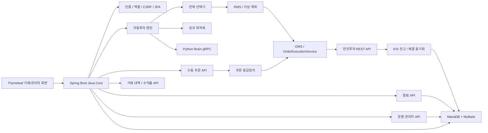

현재 한국투자 연동은 REST 기반 주문/잔고/체결 동기화가 중심이며, WebSocket 기반 실시간 체결가/호가/체결통보 수신 클라이언트가 추가되었다. WebSocket 체결통보는 REST 주문/잔고 동기화를 즉시 트리거하고, 실시간 체결가 이벤트는 틱 파이프라인으로 들어간다. 체결통보 원문은 주문번호 후보를 우선 추출해 REST 행과 대사하고, 주문번호가 없으면 종목코드 단위 대체 경로로 미스매치를 표시한다. 실제 장중 KIS 샘플을 충분히 모은 뒤 최종 필드 위치를 확정해야 한다.

## 3. Java 패키지 구조

```text
src/main/java/com/zest/trader
├── ai              # Java gRPC Brain 클라이언트, AI 신호 로그
├── audit           # 주문 요청/결과/변경 감사 로그
├── auth            # 로그인, 세션, CSRF, 2차 인증, 사용자 역할
├── autoinvest      # 자동추천, 자동주문, 성과 평가, 전략 선택 설정
├── common          # 공통코드 API, 공통코드 스키마 초기화
├── config          # Spring Security, KIS/거래 설정, 보안 헤더
├── dashboard       # Trader 화면 컨트롤러와 화면용 API
├── guard           # 주문 잠금, 실주문/자동주문 안전장치
├── history         # 거래 내역, 기간별/종목별 수익률
├── kis             # 한국투자 REST 어댑터, token/hashkey/approval key
├── market          # 종목 검색, 주문 취소/정정 등 시장 API
├── notification    # 사용자 알림 저장, 조회, 읽음 처리
├── operation       # 운영/관리자 API, 주문 감사 조회
├── performance     # 전략별 성과 조회
├── risk            # 가상 계좌, 리스크 설정, 자동정지 감사
├── sync            # KIS 잔고/주문/체결 동기화
├── trading         # OMS, 미체결 주문 관리, 틱 파이프라인, 스케줄러
└── watchlist       # 관심종목 그룹과 종목 관리
```

## 4. 사용자와 보안 모델

인증은 세션 기반이고, 세션에는 비밀번호 해시 같은 민감한 값이 들어가지 않는다. URL 접근과 화면 기능 노출은 역할 기반으로 제어한다.

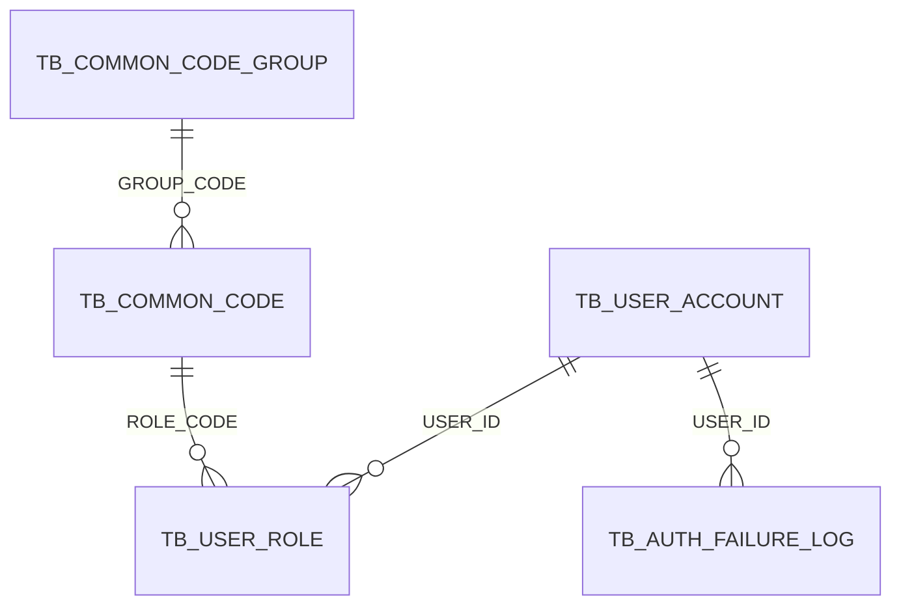

역할 구조:

- `TB_USER_ACCOUNT.ROLE_CODE`는 대표 역할 호환용이다.
- 실제 권한 판단은 `TB_USER_ROLE` 복수 row를 기준으로 한다.
- 사용자가 `TRADER`와 `ADMIN`을 동시에 가지면 trader 기능과 admin 기능을 모두 사용할 수 있다.
- 역할 코드 자체는 `TB_COMMON_CODE(GROUP_CODE = 'USER_ROLE')`에 저장한다.

보안 통제:

- CSRF token cookie/header 검증
- 2차 인증 TOTP
- BCrypt password hash
- KIS App Key/Secret/계좌 정보 암호화 및 마스킹
- `X-Content-Type-Options`, `X-Frame-Options`, `Referrer-Policy`, `Permissions-Policy`
- CDN 제거 후 로컬 WebJars/vendor static 기반 CSP 적용
- 관리자/운영 화면 접근 역할 보호
- 주문 요청/결과/취소/정정 감사 로그
- API 장애 시 사용자 알림 및 자동매매 강제 중지 경로

남은 보안 고도화:

- 관리자 승인/승격/회수 행위 전용 감사 로그
- 의존성 취약점 CI 자동 점검
- 주문/감사 로그 해시 체인 및 JSONL 아카이브 어댑터
- inline style nonce/hash 기반 CSP 추가 강화

## 5. 공통코드 관리

업무 코드는 하드코딩된 문자열 대신 `TB_COMMON_CODE_GROUP`, `TB_COMMON_CODE`로 관리한다. 서버 기동 시 `CommonCodeSchemaInitializer`가 필수 공통코드 그룹과 상세 코드를 보강한다.

주요 공통코드 그룹:

| 그룹 | 목적 |
| --- | --- |
| `USER_ROLE` | 사용자 권한 |
| `USER_APPROVAL_STATUS` | 가입 승인 상태 |
| `KIS_ENVIRONMENT` | 모의/실전 투자 환경 |
| `KIS_ORDER_DIVISION` | 한국투자 주문구분 |
| `KIS_EXCHANGE_ID_DIVISION_CODE` | 거래소 구분 |
| `STRATEGY_CODE` | 자동매매/수동 주문 전략 코드 |
| `STRATEGY_STATUS` | 전략 활성/일시정지 |
| `ORDER_STATUS` | 내부 주문 상태 |
| `SIGNAL_ACTION` | BUY/SELL/HOLD |
| `MARKET_REGIME` | 상승/횡보/하락 장세 |
| `BATCH_JOB_STATUS` | 배치 상태 |

UI는 `/api/common-codes/{groupCode}`로 필요한 코드 목록을 조회한다. 자동추천 전략 UI는 `STRATEGY_CODE` 중 `MANUAL`을 제외하고 멀티 체크박스로 표시한다.

## 6. 자동투자 모드

자동투자 기능은 세 가지 업무 흐름으로 나뉜다.

| 모드 | 설명 | 후보 출처 | 주문 제어 |
| --- | --- | --- | --- |
| 자동 추천 주문 | 시스템이 후보 종목을 스캔하고 추천 점수로 매수/매도 | 시장 필터, 점수 모델, 성과 보너스 | 자동추천 체크 + 자동주문 실행 체크 |
| 수동 주문 | 사용자가 종목/가격/수량을 직접 지정 | 사용자 입력 | 주문 확인, dry-run, 주문 잠금 |
| 선택 종목 자동 운용 | 사용자가 지정한 종목코드만 자동 평가 | 지정 종목코드 | 목표수익률, 손절률, 최대투입금액 |

자동 추천 주문의 핵심 안전 기준:

- 원금의 70%만 운용하고 30%는 비상 현금으로 남긴다.
- 기본 종목 손절 기준은 -2%다.
- 전체 손실이 -5%에 도달하면 손절/정지 경로가 동작한다.
- +2% 이후 트레일링 스탑을 적용한다.
- 당일 +3% 이상 수익 달성 시 당일 거래를 중지한다.
- 최소 2~3개 종목을 운용할 수 있도록 후보와 주문 수량을 분산한다.
- 신규 자동매수는 성과 기반 상위 3개 전략을 고르고, 각 전략이 자기 조건에 맞는 종목 1개를 매수한다.
- 전략별 매수 금액은 전체 평가자산 70% 운용 한도에서 1/3씩 균등 배정한다.
- 미체결 매수 주문은 기본 60분 이후 취소하고 다음 추천 종목으로 전환한다.

## 7. 전략 선택과 예산 분리

전략 목록은 DB 공통코드로 관리하고, 사용자별 선택은 별도 조인 테이블에 저장한다. 과거 `TB_USER_AUTO_INVESTMENT_SETTING.SELECTED_STRATEGY_CODES` CSV 방식은 제거 대상이며, 기동 시 legacy 컬럼이 있으면 새 테이블로 마이그레이션한 뒤 삭제한다.

지원 전략:

| 전략 | 목적 |
| --- | --- |
| `SCALPING` | 단기 고변동 구간 |
| `MOMENTUM_BREAKOUT` | 당일 상승률과 거래대금 돌파 |
| `RSI_REVERSAL` | 과매도 이후 반등 |
| `MACD_TREND` | MACD와 이동평균 추세 |
| `TECHNICAL_CONFLUENCE` | RSI, MACD, 볼린저밴드, 이동평균 합류 확인 |
| `OPEN_PRICE_RECLAIM` | 시가선 재돌파와 양봉 유지 |
| `OPENING_RANGE_90` | 첫 15분 오프닝 레인지와 첫 90분 돌파 |
| `LEADING_STOCK_TOPDOWN` | 매크로/펀더멘털/수급/52주 신고가/정배열 기반 주도주 선별 |
| `RL_PORTFOLIO` | 포트폴리오 비중 조절 |
| `MANUAL` | 수동 주문 집계용. 자동 운용 UI에서는 제외 |

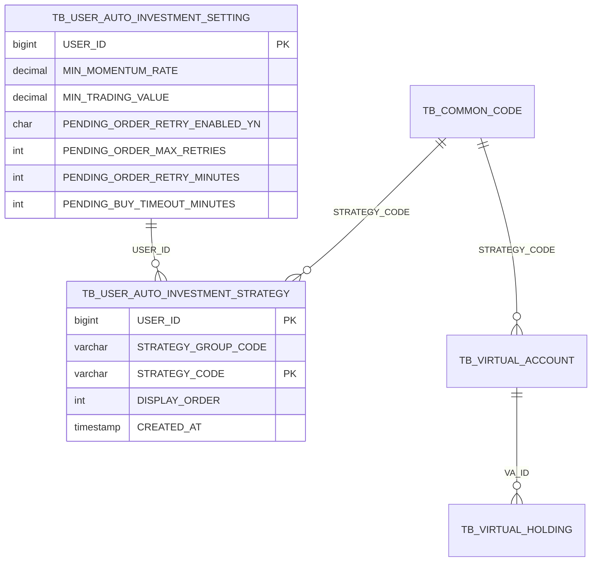

전략 선택 저장 흐름:

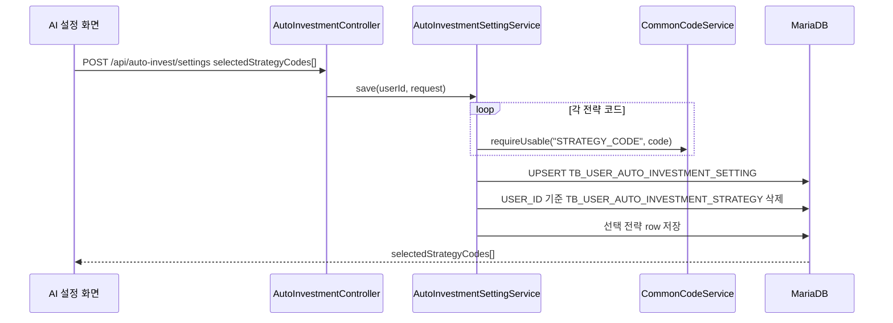

## 8. 자동추천과 주문 흐름

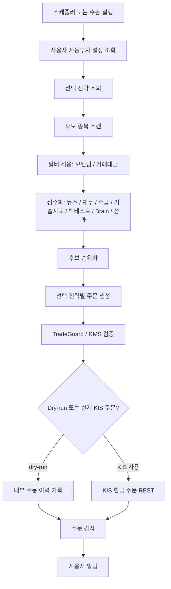

후보 점수에는 다음 기준이 포함된다.

- 장중 최소 모멘텀
- 최소 누적 거래대금
- 뉴스/관심도 점수
- 재무 점수
- 수급 점수
- 이동평균, RSI, MACD 같은 기술지표
- 백테스트 점수
- AI Brain 점수
- 과거 추천 성과 보너스/패널티

주문 실행은 다음 장치로 보호한다.

- 수동/자동 주문 허용 플래그
- KIS 사용 플래그
- dry-run 강제 설정
- KIS 호출 제한
- RestClient 타임아웃/서킷 브레이커 동작
- 주문 금액과 노출 한도 점검
- 전략별 가상 계좌 상태
- 미체결 주문 타임아웃/재시도 설정

## 9. 미체결 주문 생명주기

미체결 주문은 단순히 방치하지 않는다. 내부 pending 상태와 KIS 주문/체결 조회를 함께 사용해 재주문, 취소, 다음 후보 전환을 판단한다.

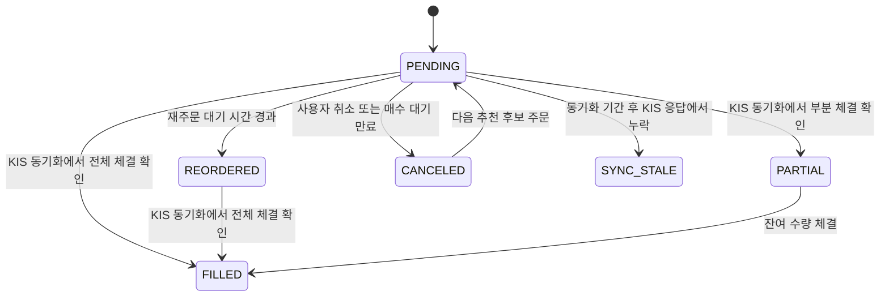

핵심 서비스:

- `PendingOrderManagementService`
- `KisSyncService`
- `OrderExecutionService`
- `OrderAuditService`

## 10. KIS 연동

한국투자 REST 구현 범위:

| 기능 | 엔드포인트 |
| --- | --- |
| OAuth2 토큰 | `/oauth2/tokenP` |
| Hashkey | `/uapi/hashkey` |
| WebSocket 승인 키 | `/oauth2/Approval` |
| 국내 주식 현재가 | `/uapi/domestic-stock/v1/quotations/inquire-price` |
| 현금 주문 | `/uapi/domestic-stock/v1/trading/order-cash` |
| 잔고 | `/uapi/domestic-stock/v1/trading/inquire-balance` |
| 주문 가능 금액 | `/uapi/domestic-stock/v1/trading/inquire-psbl-order` |
| 일별 주문/체결 | `/uapi/domestic-stock/v1/trading/inquire-daily-ccld` |

KIS 연동 상태:

| 영역 | 상태 |
| --- | --- |
| REST 토큰/hashkey/주문/잔고/체결 | 구현 완료 |
| 사용자별 암호화 KIS 설정 | 구현 완료 |
| REST 주문/체결 동기화 테이블 | 구현 완료 |
| 미체결 취소/정정 | 구현 완료 |
| WebSocket 승인 키 | 구현 완료 |
| WebSocket 현재가/체결 수신기 | 기준선 구현 |
| WebSocket 재연결/backoff | 기준선 구현 |
| WebSocket 이벤트와 주문 대사 | 기준선 구현. 체결통보는 REST 동기화를 트리거하고, 보고서는 주문번호 우선 비교 후 종목코드 대체 경로를 사용한다 |

대사 규칙:

- WebSocket 체결통보 원문 payload는 `TB_KIS_REALTIME_EVENT`에 저장한다.
- caret 구분 payload에서 `ORDER_ID`를 가능한 범위에서 추출하고 사용자/시각과 함께 인덱싱한다.
- REST 체결 row는 `TB_KIS_ORDER_EXECUTION`에 저장한다.
- 운영 보고서는 주문번호가 있으면 `USER_ID + ORDER_ID` 기준으로 묶는다.
- 실시간 WebSocket 샘플에서 예상 패턴의 주문번호가 보이지 않으면 종목코드 단위 그룹으로 대체하고, REST/WS 누락 건수로 남은 불일치를 표시한다.

## 11. 성과 평가와 튜닝

장마감 후 자동추천 운용 성과를 평가하고 다음 추천 파라미터에 반영한다.

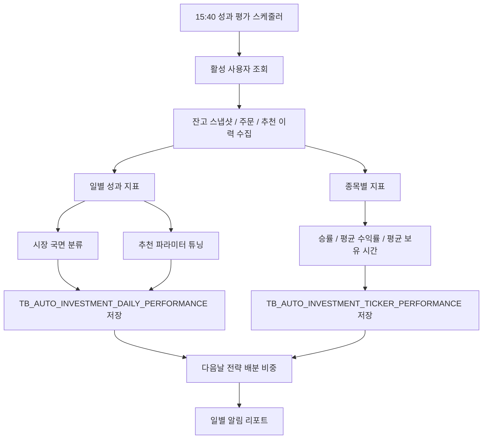

저장/파생 지표는 다음과 같다.

- 일별 수익률
- 실현/평가/총 손익
- MDD
- 손익비
- 승률
- 평균 보유 시간(분)
- 주문 실패율
- 추천 점수와 수익률의 상관
- 반복 진입 횟수
- 시장 국면
- 추천 최소 모멘텀
- 추천 최소 거래대금
- 전략 배분 비중

UI에는 전략 성과와 거래 수익률 화면이 있다. 더 풍부한 리포트 시각화와 과최적화 방어 장치는 향후 고도화 대상이다.

## 12. 알림 구조

알림은 주문 결과, API 장애, 리스크 이벤트, 성과 리포트처럼 사용자가 바로 알아야 하는 사건을 `TB_USER_NOTIFICATION`에 저장한다.

홈 요약 알림과 전체 알림 페이지는 의도적으로 분리했다.

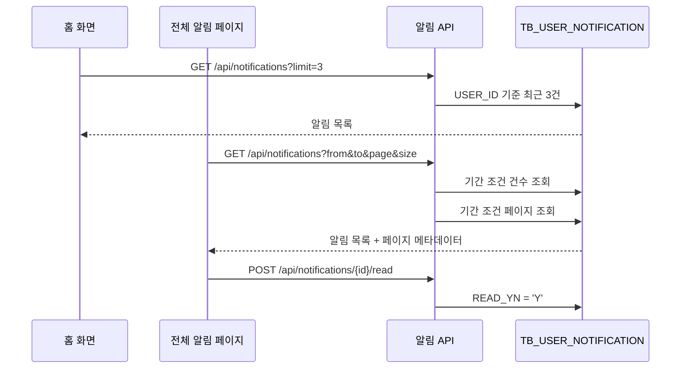

기본값:

- 홈 알림 목록: 최근 3건
- 전체 알림 페이지 기본 기간: D-7부터 오늘까지
- 페이지 크기: 10, 20, 50
- 읽지 않은 알림 수 엔드포인트: `/api/notifications/unread-count`

## 13. 거래 내역과 수익률 화면

거래 내역 화면은 주문 이력과 최신 실보유 스냅샷을 함께 사용해 수익률을 보여준다.

지원 화면:

- 페이지 기반 거래 내역
- `from`, `to` 기준 검색, 기본값 D-7
- 손익 요약
- 기간별 수익률
- 종목별 수익률
- 백테스트 결과

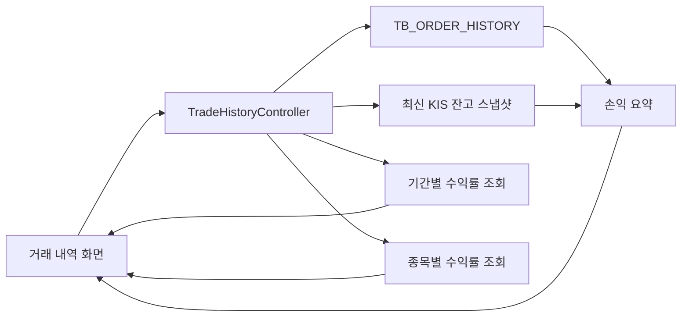

## 14. Python Brain 엔진

Java와 Python은 `src/main/proto/aitrader.proto`를 통해 통신한다. Python 쪽은 향후 운영 모델을 연결하기 위한 안정적인 모델 어댑터 경계를 제공한다.

현재 상태:

| 모델 영역 | 현재 구현 | 목표 |
| --- | --- | --- |
| `SCALPING` | 제한된 틱 버퍼 + 모멘텀 기본 모델 | CNN/LSTM 틱/L2 모델 |
| `OPENING_RANGE_90` | Java M1 캔들 기반 오프닝 레인지 돌파 휴리스틱 | 장중 백테스트 검증 및 선택적 Python 어댑터 연결 |
| `LEADING_STOCK_TOPDOWN` | Java D1 캔들과 현재가 기반 탑다운 주도주 휴리스틱 | 매크로, 수출 HS 코드, 컨센서스, 동종 종목 연동 데이터 연결 |
| `RL_PORTFOLIO` | 현금 비중 기본 모델 | PPO/SAC 포트폴리오 배분기 |
| gRPC 계약 | 구현 완료 | 모델 업그레이드에도 안정적으로 유지 |
| 모델 산출물/버전 레지스트리 | 기준선 구현 | 운영 승격 관문, 점수 임계값, 롤백 승인 메타데이터 추가 |

중요한 경계:

- Java는 Python 모델 특성값의 내부 구조를 알 필요가 없다.
- Python은 action, weight, confidence, target weight, strategy code, reason으로 구성된 간결한 `SignalResponse`를 반환한다.
- Java RMS가 해당 신호를 실제 주문으로 실행할 수 있는지 최종 판단한다.

## 15. Kafka와 틱 파이프라인

동기/인메모리 틱 파이프라인은 안전한 기본값으로 남아 있다. Kafka는 `zest.kafka.enabled=true`로 켤 수 있다. 활성화되면 외부 틱 입력은 `market_tick_data`로 발행되고, Kafka 소비자가 기존 제한 크기 거래 큐로 전달한다.

현재 틱 경로:

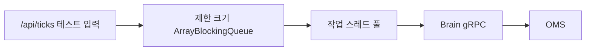

Kafka 경로:

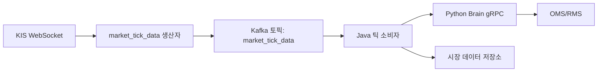

Kafka 운영에는 현재 다음 항목이 포함된다.

- `docker-compose.kafka.yml`의 로컬 Kafka Compose 프로필
- `docs/kafka-operations-guide.md`의 `market_tick_data`, `market_tick_data_dlq` 토픽 운영 절차서
- 소비자 파싱 실패 시 DLQ 라우팅
- `/admin/api/operations/kafka-lag` 지연 스냅샷
- 관리자 운영 화면의 지연 표시

남은 Kafka 운영 작업:

- IaC 기반 운영 토픽 생성 적용
- 실제 트래픽 분포 측정 후 종목코드 기준 파티셔닝 튜닝

## 16. 일봉 자동 보강

`D1` 일봉은 자동추천, 백테스트, 장마감 학습 특성값 생성의 공통 입력이다. 운영에서는 서버가 기동 중이고 활성 KIS 설정이 하나 이상 있으면 평일 16:10에 전체 종목의 최근 30일 일봉을 자동 보강한다.

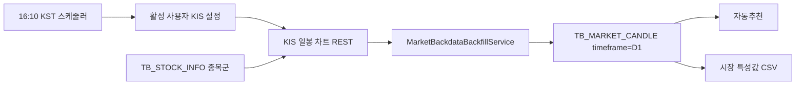

주요 설정:

- `zest.trading.daily-candle-backfill.enabled=true`
- `zest.trading.daily-candle-backfill.cron=0 10 16 * * MON-FRI`
- `zest.trading.daily-candle-backfill.days=30`

안전 동작:

- 한 번에 하나의 일봉 보강 작업만 실행한다.
- 이미 보강된 종목코드는 최소 기대 D1 캔들 수 기준으로 건너뛴다.
- 일시적인 KIS 타임아웃/reset/서킷 장애는 재시도 대기 시간을 두고 다시 시도한다.
- 활성 KIS 설정이 없으면 애플리케이션을 실패시키지 않고 상태를 `SKIPPED`로 남긴다.

## 17. 운영 모니터링

구현되었거나 일부 구현된 지표/로그 화면:

- KIS API 호출 로그
- KIS 지연 시간 지표
- 추천 실행 시간 지표
- 주문 실패율
- 미체결 재주문 수
- 자동투자 성과 평가 실행/실패 수
- 관리자 운영 화면의 주문 감사 로그
- 운영 오류 로그
- 사용자 알림

남은 운영 과제:

- 모든 지표를 한곳에서 보는 대시보드
- Slack/Telegram/email 알림 라우팅
- 로그 불변성
- SLO/SLA 임계값

## 18. 구현 상태

| 영역 | 상태 | 비고 |
| --- | --- | --- |
| MyBatis 영속화 | 완료 | JPA 미사용 |
| 공통코드 관리 | 완료 | 코드 초기 적재 및 API 제공 |
| 다중 역할 사용자 권한 | 완료 | `TB_USER_ROLE`가 TRADER + ADMIN 조합을 지원 |
| 자동 전략 멀티 선택 | 완료 | `TB_USER_AUTO_INVESTMENT_STRATEGY`로 정규화 |
| REST KIS 주문/잔고/체결 | 완료 | token, hashkey, 주문, 잔고, 일별 체결 |
| 미체결 재주문/매수 대기 만료 | 완료 | 재시도 및 다음 후보 전환 |
| 알림 페이지네이션/기간 검색 | 완료 | D-7 기본값 |
| 거래 내역 페이지네이션/수익률 | 완료 | 기간별/종목별 수익률 화면 |
| 일봉 D1 자동 보강 | 기준선 완료 | 평일 16:10 예약 보강, 기본 활성화 |
| 전략 성과 평가 | 기준선 완료 | 장기 차트, 과최적화 경고 UX, 60일 임계값 검증 상태 추가. 최종 임계값은 누적 실거래 샘플에 의존 |
| CSP/보안 헤더 | 기준선 완료 | CDN 제거, WebJars/vendor static 적용. inline style nonce/hash는 추가 강화 가능 |
| WebSocket 실시간 동기화 | 기준선 완료 | 수신기, 구독, ping/pong, 상태 API, 체결 기반 REST 동기화, 필드 검증, 원문 이벤트 로그, 주문번호 대사, 재시도 대기 상태 구현 |
| Kafka 틱 파이프라인 | 기준선 완료 | 생산자/소비자, 직접 대체 경로, DLQ 라우팅, 로컬 Kafka 가이드, 지연 대시보드 구현 |
| Python 실제 CNN/LSTM/PPO/SAC | 기준선 완료 | 자동 학습, 데이터 품질 리포트, 최신 레지스트리, 선택적 ONNX 내보내기 구현. 운영 모델 품질은 실데이터 축적에 의존 |
| 관리자 행위 감사 | 기준선 완료 | 관리자 행위 해시 체인 로그 구현 |
| 의존성 취약점 CI | 기준선 완료 | OSV scanner GitHub workflow 추가 |
| 감사 로그 위변조 저항성 | 기준선 완료 | 주문/관리자 감사 해시 체인과 JSONL 아카이브 어댑터 구현. 운영 CloudWatch/S3 Object Lock 검증은 남아 있음 |

## 19. 장애와 안전 기준

거래 의사결정은 실패 시 닫히는 방향으로 동작해야 한다.

- Brain gRPC가 타임아웃되면 신호를 `HOLD`로 처리한다.
- KIS API가 반복 실패하면 사용자에게 알리고 자동매매를 중지할 수 있다.
- 미체결 주문 상태를 대사할 수 없으면 무작정 반복 주문하지 않는다.
- 선택한 전략 코드가 유효하지 않거나 비활성화되어 있으면 설정 저장을 거부한다.
- 선택 전략 row가 없으면 기본 병행 전략을 복구한다.
- D1 backfill에 활성 KIS 설정이 없으면 `SKIPPED`를 기록하고 무의미한 API 호출을 피한다.
- dry-run 요청이면 실제 증권사 주문을 보내지 않는다.

## 20. 참고 문서

- [README.md](../README.md)
- [README_BE.md](../README_BE.md)
- [README_FE.md](../README_FE.md)
- [README_DA.md](../README_DA.md)
- [README_SE.md](../README_SE.md)
- [deployment-guide.md](deployment-guide.md)
