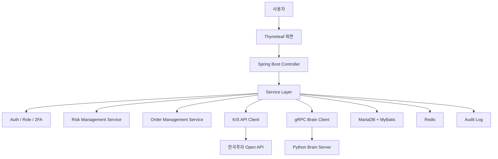
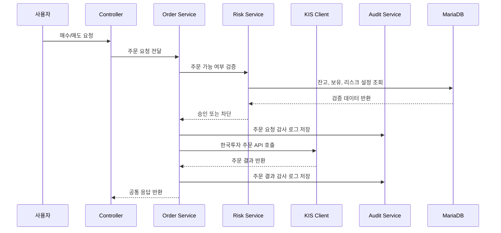
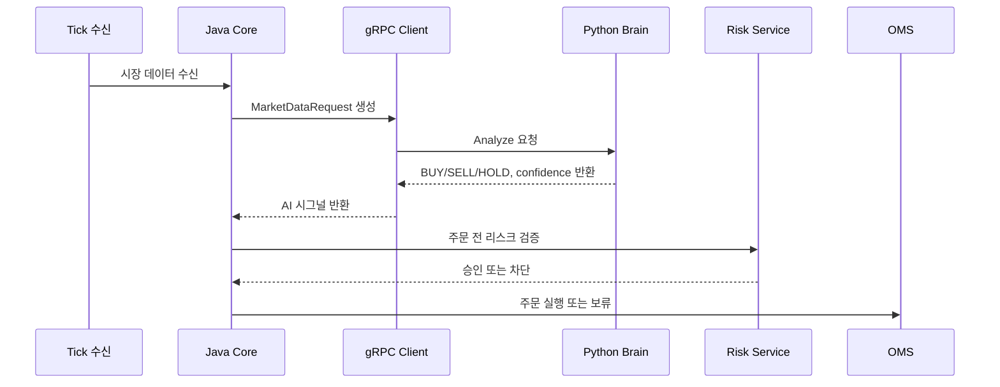

# 백엔드에 관심이 있는 학생 관점 포트폴리오


> 실제 증권사 API와 AI 판단 엔진을 연결하는 주식 거래 백엔드를 Java Spring Boot, MyBatis, gRPC, Python Brain 기반으로 설계하고 구현했습니다.
> 단순 CRUD가 아니라 `인증 -> KIS 설정 -> 주문 요청 -> 리스크 검증 -> 주문 실행 -> 감사 로그 -> 장애 대응`까지 이어지는 백엔드 흐름을 만드는 데 초점을 두었습니다.


| 항목 | 내용 |
| --- | --- |
| 문서 버전 | Career Backend v2.3 |
| 관심 직무 | Backend Engineer |
| 한 줄 소개 | 실제 주문 사고를 줄이는 자동매매 백엔드 시스템 |
| 담당 역할 | Spring Boot API, MyBatis SQL, KIS REST/WebSocket 연동, OMS/RMS, 인증/인가, 운영 감사 |
| 주요 기술 | Java 17, Spring Boot 3.5, MyBatis, MariaDB, Redis, gRPC, Protocol Buffers, AWS KMS |
| 관련 문서 | [README](../../README.md), [아키텍처 문서](../architecture.md), [배포/실행 가이드](../deployment-guide.md), [보안 운영 가이드](../SECURITY_OPERATION_GUIDE.md) |

## 1. 이 프로젝트에서 해결하려고 한 문제

백엔드 관점에서 이 프로젝트의 핵심 문제는 “주문을 실행하는 API를 어떻게 안전하게 운영할 것인가”였습니다. 주식 거래 시스템은 일반 게시판이나 관리 화면과 다르게, 외부 API 실패나 중복 요청이 실제 금전 손실로 이어질 수 있습니다.

- 주문 요청 전에 사용자의 현금, 보유 종목, 리스크 설정을 검증할 수 있을까요?
- 한국투자 API 장애가 발생하면 자동매매를 멈출 수 있을까요?
- AI 판단이 잘못되어도 주문 시스템이 별도로 방어할 수 있을까요?
- 사용자별 API key와 계좌 정보를 안전하게 분리할 수 있을까요?
- 장애가 났을 때 요청, 응답, 사용자, 시각을 추적할 수 있을까요?

저는 이 질문에 답하기 위해 주문 실행 백엔드, 리스크 관리, 감사 로그, 사용자별 KIS 설정, Python Brain 연동을 하나의 흐름으로 설계했습니다.

## 2. 5초 요약

| 질문 | 답 |
| --- | --- |
| 무엇을 만들었나요 | 한국투자증권 Open API 기반 자동매매 백엔드입니다 |
| 어떤 역할을 맡았나요 | 주문 API, 리스크 검증, KIS 연동, MyBatis SQL, gRPC Brain 연동을 설계했습니다 |
| 왜 어려웠나요 | 주문 시스템은 API 장애, 중복 주문, 권한 오류, secret 노출이 바로 사고로 이어질 수 있습니다 |
| 어떻게 풀었나요 | Java Core가 주문과 리스크를 책임지고, Python Brain은 AI 판단만 맡도록 분리했습니다 |
| 무엇을 검증했나요 | 로컬 실행, Gradle 테스트, Brain 연동 확인, 주문 감사 흐름, KIS 장애 대응 흐름을 확인했습니다 |

## 3. Demo: 실행 증거

이 프로젝트는 실계좌 주문으로 이어질 수 있기 때문에 공개 데모보다 로컬 재현성과 모의투자 검증 흐름을 우선했습니다. 위 GIF는 현재 브라우저 화면에서 `자동추천 -> RMS 검증 -> 차트 기반 주문 -> 감사/재학습` 흐름이 어떻게 이어지는지 보여줍니다. 주문 화면에서는 모의 주문, 실주문 요청, 체결 완료 상태가 서로 다른 마커로 표시됩니다.

백엔드 관점에서는 화면 자체보다 각 화면 뒤의 서버 책임을 봅니다.

| 화면 흐름 | 백엔드에서 확인할 책임 |
| --- | --- |
| 자동추천 | 전략별 성과, 선택 전략, AI 판단 로그를 API로 제공합니다 |
| RMS 검증 | 주문 전 예산, 손실 한도, 실주문 잠금 상태를 서버에서 검증합니다 |
| 주문 | dry-run 주문, 실주문 요청, 체결 완료를 상태별로 분리하고 주문 이력을 남깁니다 |
| 감사/재학습 | 주문 결과, 백테스트, feature 생성 흐름을 추적 가능한 데이터로 남깁니다 |

```bash
cd /Users/zest/git/stoackAI
python/scripts/setup_local.sh
python/scripts/run_brain.sh
```

다른 터미널에서 Java Core를 실행합니다.

```bash
cd /Users/zest/git/stoackAI
./gradlew bootRun
```

연동 확인은 아래 명령으로 수행합니다.

```bash
curl http://localhost:8090/api/status
curl http://localhost:8090/api/accounts
python/.venv/bin/python python/scripts/smoke_test.py
```

## 4. Backend Features: 핵심 기능

### 주문과 리스크 검증

- 매수/매도 요청 전에 보유 현금, 보유 종목, 리스크 설정, 자동매매 잠금 상태를 검증합니다.
- 일 손실 한도, 종목 집중도, 주문 횟수, 손절/익절 조건을 서버에서 통제합니다.
- 미체결 주문은 만료, 취소, 재주문, 다음 후보 전환 흐름으로 관리합니다.
- 주문 요청과 주문 결과는 감사 로그로 남겨 사고 추적이 가능하도록 했습니다.

### 한국투자 API 연동

- 사용자별 KIS App Key, Secret, 계좌번호, HTS ID를 분리 저장했습니다.
- 토큰 발급, 현재가 조회, 주문, 잔고, 주문 가능 금액, 체결 조회 흐름을 백엔드 API로 감쌌습니다.
- timeout, retry, rate limit, circuit breaker, force stop을 적용해 외부 API 장애에 대응했습니다.
- WebSocket 체결 이벤트와 REST 주문/잔고 동기화를 연결하는 구조를 반영했습니다.

### Java Core와 Python Brain 분리

- Java Core는 인증, 주문, 리스크, DB 트랜잭션, KIS 연동을 담당합니다.
- Python Brain은 gRPC 기반 AI 추론과 전략 라우팅만 담당합니다.
- Protobuf 계약을 기준으로 BUY/SELL/HOLD와 신뢰도만 교환하게 했습니다.
- Brain이 실패해도 주문 시스템은 별도 리스크 검증으로 방어할 수 있게 했습니다.

### 운영 백엔드 요소

- Redis 기반 인증 실패 제한을 적용했습니다.
- SMTP 발송과 로컬 로그 발송을 환경별로 분리했습니다.
- AWS KMS 기반 DB 비밀번호 외부화 구조를 반영했습니다.
- GitHub Actions에서 Gradle 테스트와 OSV 의존성 점검을 수행합니다.

## 5. 설계하면서 중요하게 본 판단

| 판단 | 선택 | 이유 |
| --- | --- | --- |
| ORM 선택 | MyBatis | 금융 도메인은 실행 SQL 추적성과 운영 중 확인 가능성이 중요하다고 판단했습니다 |
| AI 연동 방식 | gRPC + Protobuf | Java와 Python의 책임을 분리하면서 계약을 명확히 하기 위해 선택했습니다 |
| 사용자별 증권사 설정 | `TB_USER_KIS_CONFIG` | 여러 사용자가 각자의 API key와 계좌를 사용할 수 있어야 했습니다 |
| 주문 안전장치 | OMS + RMS + 감사 로그 | 주문 실행보다 주문 전 방어와 사고 추적을 더 중요하게 봤습니다 |
| 장애 대응 | retry, rate limit, circuit breaker | 외부 API 장애가 반복 주문으로 이어지지 않게 막기 위해 선택했습니다 |
| 운영 secret | 환경 변수 + KMS 확장 | 설정 파일과 저장소에 평문 secret을 남기지 않기 위해 선택했습니다 |

## 6. Architecture: 백엔드 구조



### 패키지 구조

```text
src/main/java/com/zest/trader
├── auth            # 로그인, 세션, 2차 인증, 역할
├── kis             # 한국투자 REST/WebSocket adapter
├── trading         # OMS, 주문 실행, 미체결 주문
├── risk            # RMS, 가상계좌, 리스크 설정
├── autoinvest      # 자동추천, 자동주문, 전략 평가
├── audit           # 주문 감사, 관리자 감사
├── ai              # gRPC Brain client
├── operation       # 운영 API, 오류 로그, 지표
└── config          # Security, KIS, Brain, Kafka 설정
```

## 7. 주요 흐름

### 주문 처리 흐름



### AI 추론 연동 흐름



## 8. Runbook: 실행 절차

| 항목 | 기준 |
| --- | --- |
| Java | JDK 21 권장, compile target은 Java 17 |
| Python | Python 3.13.x |
| DB | MariaDB `aitrader` schema |
| 기본 포트 | Java Core `8090`, Python Brain `50051` |

```bash
cd /Users/zest/git/stoackAI
python/scripts/setup_local.sh
./gradlew test
./gradlew bootRun
```

## 9. Troubleshooting: 문제 해결

| 증상 | 확인할 것 | 해결 |
| --- | --- | --- |
| DB 연결에 실패합니다 | `ZEST_DB_URL`, 계정, schema를 확인합니다 | MariaDB와 `aitrader` schema를 준비합니다 |
| Brain 호출이 실패합니다 | Python Brain 포트와 gRPC 생성 파일을 확인합니다 | `python/scripts/run_brain.sh`, `smoke_test.py`를 실행합니다 |
| KIS 주문이 실행되지 않습니다 | 사용자별 KIS 설정과 장중 여부를 확인합니다 | 처음에는 모의투자(paper) 환경에서 검증합니다 |
| 주문이 차단됩니다 | RMS 설정, 자동매매 잠금, 일 손실 한도를 확인합니다 | 리스크 설정과 주문 가능 금액을 다시 확인합니다 |
| 인증 실패가 반복됩니다 | Redis 실패 제한과 DB 실패 로그를 확인합니다 | 제한 해제 시간과 실패 사유를 확인합니다 |

## 10. Interview Notes: 면접 답변

### 1분 소개

저는 ZEST AI Trader에서 실제 증권사 API와 AI 판단 엔진을 연결하는 백엔드 구조를 설계했습니다. Java Core가 주문, 리스크, 인증, DB 트랜잭션을 책임지고 Python Brain은 AI 추론만 담당하도록 gRPC 경계를 나누었습니다. 특히 주문 시스템은 장애나 중복 요청이 실제 손실로 이어질 수 있기 때문에, 주문 전 리스크 검증과 감사 로그, 외부 API 장애 대응을 먼저 설계했습니다.

### STAR 답변 예시

| 구분 | 답변 |
| --- | --- |
| 상황 | AI 판단 결과를 바로 주문으로 연결하면 모델 오류가 주문 사고로 이어질 수 있었습니다 |
| 과제 | AI 실험 속도는 유지하면서 주문 안정성과 운영 추적성을 확보해야 했습니다 |
| 행동 | Java Core와 Python Brain을 gRPC로 분리하고, 주문 전 RMS와 감사 로그를 추가했습니다 |
| 결과 | 모델 변경과 주문 실행이 분리되었고, 장애 발생 시 주문을 차단하고 추적할 수 있는 구조가 되었습니다 |

### 꼬리 질문 대비

| 질문 | 답변 방향 |
| --- | --- |
| 왜 MyBatis를 선택했나요 | SQL 추적성과 운영 중 쿼리 확인이 중요하다고 판단했습니다 |
| AI가 틀리면 어떻게 하나요 | AI 판단은 주문 조건 중 하나이고, RMS와 주문 정책이 별도로 방어합니다 |
| 외부 API 장애는 어떻게 처리했나요 | timeout, retry, rate limit, circuit breaker, force stop을 적용했습니다 |
| 다중 사용자는 어떻게 고려했나요 | 사용자별 KIS 설정과 역할 구조를 분리했습니다 |

## 11. Portfolio Checklist: 제출 전 점검

| 체크 | 제가 확인한 기준 |
| --- | --- |
| 문제 정의 | 주문 백엔드가 왜 일반 CRUD보다 위험한지 설명했습니다 |
| 담당 범위 | API, SQL, KIS 연동, RMS, 감사 로그 범위를 명확히 했습니다 |
| 구조 | Controller, Service, Mapper, 외부 API adapter 책임을 분리했습니다 |
| 기술 선택 | MyBatis, gRPC, Redis, KMS 선택 이유를 정리했습니다 |
| 장애 대응 | 외부 API 실패와 자동매매 중지 흐름을 설명했습니다 |
| 면접 전환 | README 문장이 백엔드 면접 답변으로 이어지도록 구성했습니다 |

## 12. Reference Docs: 참고 문서

| 문서 | 내용 |
| --- | --- |
| [README](../../README.md) | 전체 프로젝트 README |
| [docs/architecture.md](../architecture.md) | 전체 아키텍처 |
| [docs/deployment-guide.md](../deployment-guide.md) | 실행/배포 가이드 |
| [docs/python-brain-local-guide.md](../python-brain-local-guide.md) | Python Brain 연동 |
