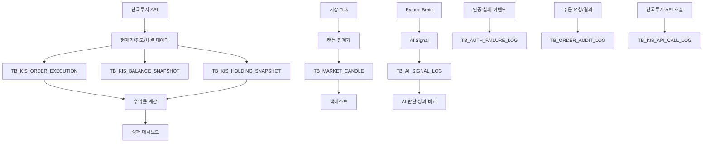
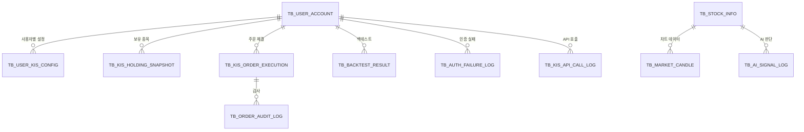
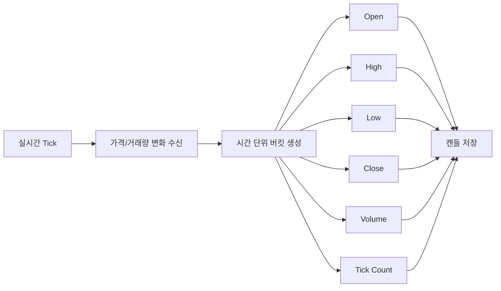
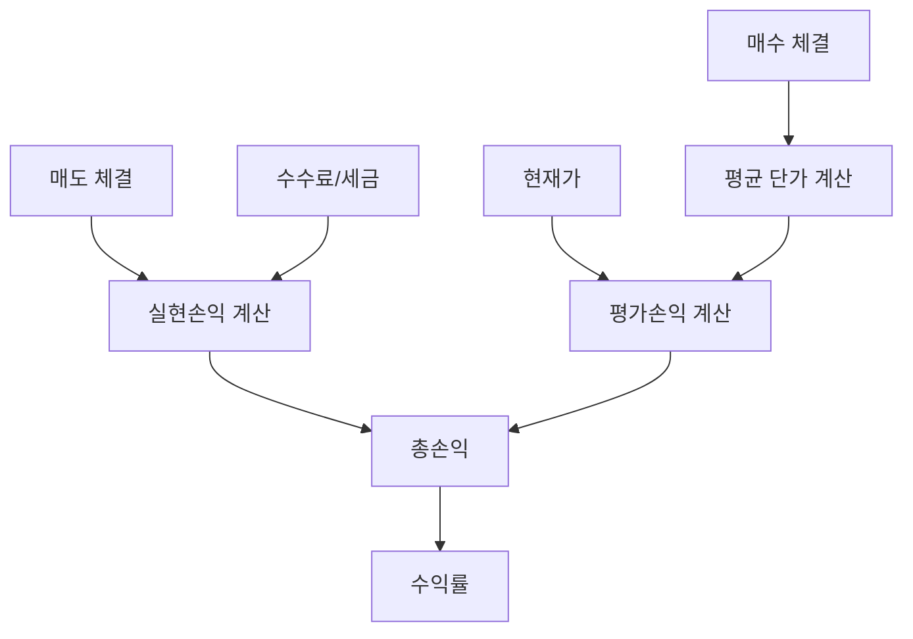

# 데이터에 관심이 있는 학생 관점 포트폴리오


> 주식 시장 데이터, 주문 체결 데이터, AI 판단 로그를 재학습과 성과 분석에 활용할 수 있도록 수집·정제·집계·검증 구조를 설계했습니다.
> 데이터를 많이 저장하는 것보다 `분석 가능한 형태로 남기는 것`을 더 중요하게 보고 설계했습니다.


| 항목 | 내용 |
| --- | --- |
| 문서 버전 | Career Data v2.3 |
| 관심 직무 | Data Engineer / Data Analyst |
| 한 줄 소개 | 자동매매 의사결정을 검증할 수 있는 데이터 구조 설계 |
| 담당 역할 | 캔들 집계, AI 신호 로그, 수익률 계산, 감사 데이터, feature CSV, model registry 흐름 정리 |
| 주요 기술 | MariaDB, MyBatis SQL, OHLCV, Kafka tick pipeline, Python feature pipeline, Model Registry |
| 관련 문서 | [README](../../README.md), [아키텍처 문서](../architecture.md), [데이터/보안 문서](../data_security.txt) |

## 1. 이 프로젝트에서 해결하려고 한 문제

데이터 관점에서 이 프로젝트의 핵심 문제는 “자동매매 결과를 나중에 검증할 수 있는가”였습니다. 단순히 주문 결과만 저장하면 왜 수익이 났는지, 왜 손실이 났는지, AI 판단이 맞았는지 설명하기 어렵습니다.

- 시장 tick을 모두 저장해야 할까요, 아니면 캔들로 집계해야 할까요?
- AI 판단 시점의 입력과 결과를 나중에 비교할 수 있을까요?
- 실현손익, 평가손익, 총손익을 분리할 수 있을까요?
- 백테스트 결과와 실제 주문 결과를 비교할 수 있을까요?
- 인증 실패, API 장애, 주문 감사 같은 운영 데이터도 분석할 수 있을까요?

저는 이 질문에 답하기 위해 시장 데이터, 주문 데이터, AI 신호, 감사 데이터를 분리하고 다시 연결할 수 있는 구조로 설계했습니다.

## 2. 5초 요약

| 질문 | 답 |
| --- | --- |
| 무엇을 만들었나요 | 자동매매 판단과 결과를 분석할 수 있는 데이터 흐름입니다 |
| 어떤 역할을 맡았나요 | 캔들 집계, AI 신호 로그, 수익률 계산, 감사 데이터 모델을 설계했습니다 |
| 왜 어려웠나요 | 투자 데이터는 시점, 가격, 체결, 수익률, 모델 판단이 함께 맞아야 분석할 수 있습니다 |
| 어떻게 풀었나요 | raw tick 전체 저장보다 캔들 집계를 우선하고, 판단 로그와 결과 데이터를 연결했습니다 |
| 무엇을 검증했나요 | feature CSV, model registry, 수익률 계산, 감사 로그, 장애 분석 흐름을 확인했습니다 |

## 3. Demo: 실행 증거

위 GIF는 현재 브라우저 화면에서 자동추천 결과, 전략별 성과, 차트 기반 주문 검증, 거래 내역, 백테스트, 재학습 근거가 어떻게 연결되는지 보여줍니다. 차트 장면에서는 캔들, 거래량, 주문 상태 마커가 같은 시간축 위에 놓입니다.

데이터 관점에서는 화면에 보이는 값이 어떤 저장/집계/학습 데이터로 이어지는지 확인합니다.

| 화면 흐름 | 데이터에서 확인할 기준 |
| --- | --- |
| 자동추천 | 전략 점수, AI confidence, 추천 시점 가격을 판단 로그로 남깁니다 |
| RMS 검증 | 전략별 가상 계좌와 총액 배분 비율을 데이터로 계산합니다 |
| 주문 | 주문 요청, dry-run 결과, 실주문 요청, 체결 상태를 감사 가능한 이력으로 저장합니다 |
| 감사/재학습 | 백테스트, 실현손익, feature CSV, model registry를 연결합니다 |

데이터 생성과 학습 흐름은 아래 명령으로 확인할 수 있습니다.

```bash
cd /Users/zest/git/stoackAI
python/.venv/bin/python python/scripts/generate_market_features.py
python/.venv/bin/python python/scripts/auto_train_and_register.py --epochs 12
```

테스트와 애플리케이션 실행:

```bash
./gradlew test
./gradlew bootRun
```

## 4. Data Features: 핵심 기능

### 시장 데이터 집계

- 실시간 tick 원본 전체를 무작정 저장하지 않고 OHLCV 캔들로 집계했습니다.
- 시가, 고가, 저가, 종가, 거래량, tick count를 기준으로 차트와 백테스트에 활용할 수 있도록 했습니다.
- 장기 운영 비용과 조회 성능을 함께 고려했습니다.

### AI 판단 로그

- AI 판단 결과만 저장하지 않고 입력 데이터 해시, 판단 결과, 신뢰도, 실제 가격을 함께 남겼습니다.
- BUY/SELL/HOLD 판단과 실제 결과를 비교할 수 있도록 설계했습니다.
- model registry의 최신 모델과 Java 자동추천 흐름을 연결했습니다.

### 수익률과 성과 분석

- 수익률을 단순 매수/매도 합계가 아니라 실현손익, 평가손익, 총손익으로 분리했습니다.
- 전략별 승률, 평균수익률, 보유시간, MDD, 체결 실패율을 분석할 수 있도록 했습니다.
- 백테스트 결과와 실제 운용 결과를 비교할 수 있는 데이터 흐름을 구성했습니다.

### 감사 데이터

- 로그인 실패, 2차 인증 실패, 주문 요청/결과, API 호출 로그를 분리했습니다.
- 운영 장애와 보안 이벤트를 각각 분석할 수 있도록 저장 기준을 나누었습니다.
- 비밀번호와 인증 코드 같은 민감값은 저장하지 않도록 했습니다.

## 5. 설계하면서 중요하게 본 판단

| 판단 | 선택 | 이유 |
| --- | --- | --- |
| 시장 데이터 저장 | raw tick보다 캔들 집계 우선 | 저장 비용과 조회 성능을 함께 고려했습니다 |
| AI 판단 기록 | 판단 + 입력 해시 + 실제 결과 | 모델 판단을 사후 검증할 수 있어야 했습니다 |
| 수익률 모델 | 실현손익/평가손익/총손익 분리 | 투자 성과를 더 정확하게 분석하기 위해 선택했습니다 |
| 감사 데이터 | 인증/주문/API 로그 분리 | 보안 분석과 운영 장애 분석 목적이 다르다고 판단했습니다 |
| feature 생성 | DB 기반 CSV 생성 | 학습 데이터를 재현 가능한 형태로 만들기 위해 선택했습니다 |

## 6. Architecture: 데이터 구조



### 주요 데이터 모델



## 7. 주요 흐름

### 캔들 집계 흐름



### 수익률 계산 흐름



### AI 판단 데이터

| 데이터 | 의미 | 활용 |
| --- | --- | --- |
| `INPUT_DATA_HASH` | 입력 상태 데이터 요약 | 재현성 확인 |
| `PREDICTED_ACTION` | BUY, SELL, HOLD | 모델 판단 분석 |
| `CONFIDENCE` | 신뢰도 | 모델 판단 신뢰도 분석 |
| `ACTUAL_PRICE` | 판단 시점 가격 | 사후 성과 비교 |
| `CREATED_AT` | 판단 시각 | 시계열 분석 |

## 8. Runbook: 실행 절차

```bash
cd /Users/zest/git/stoackAI
python/scripts/setup_local.sh
python/.venv/bin/python python/scripts/generate_market_features.py
python/.venv/bin/python python/scripts/auto_train_and_register.py --epochs 12
```

## 9. Troubleshooting: 문제 해결

| 증상 | 확인할 것 | 해결 |
| --- | --- | --- |
| feature CSV가 비어 있습니다 | 시장 캔들, 추천, 주문 데이터 적재 여부를 확인합니다 | `generate_market_features.py` 로그를 확인합니다 |
| 모델 학습이 실패합니다 | feature row 수와 의존성 설치 상태를 확인합니다 | `python/scripts/setup_local.sh`를 재실행합니다 |
| 차트 데이터가 부족합니다 | `TB_MARKET_CANDLE` 적재 상태를 확인합니다 | 백필 또는 tick 집계 흐름을 확인합니다 |
| 수익률이 맞지 않습니다 | 체결 수량, 평균단가, 수수료/세금 반영 여부를 확인합니다 | 실현손익과 평가손익 계산을 분리해 확인합니다 |
| 감사 분석이 어렵습니다 | 인증/주문/API 로그가 분리되어 있는지 확인합니다 | 이벤트 유형과 발생 시각 기준으로 조회합니다 |

## 10. Interview Notes: 면접 답변

### 1분 소개

저는 ZEST AI Trader에서 자동매매 결과를 나중에 검증할 수 있도록 데이터 구조를 설계했습니다. 단순히 많은 데이터를 저장하기보다, AI 판단 시점의 입력과 결과, 실제 체결, 수익률, 감사 로그를 연결할 수 있는 형태로 남기는 데 집중했습니다. 특히 raw tick 전체 저장보다 캔들 집계를 우선해 저장 비용과 조회 성능을 함께 고려했습니다.

### STAR 답변 예시

| 구분 | 답변 |
| --- | --- |
| 상황 | 자동매매 결과만 저장하면 왜 수익이나 손실이 났는지 분석하기 어려웠습니다 |
| 과제 | AI 판단, 시장 데이터, 주문 결과, 수익률을 연결해야 했습니다 |
| 행동 | 캔들 집계, AI 신호 로그, 체결 데이터, 수익률 계산 구조를 분리해 설계했습니다 |
| 결과 | 전략별 성과와 AI 판단 결과를 사후 분석할 수 있는 데이터 흐름을 만들었습니다 |

### 꼬리 질문 대비

| 질문 | 답변 방향 |
| --- | --- |
| 왜 raw tick 전체를 저장하지 않았나요 | 비용과 조회 성능을 고려해 캔들 집계를 우선했습니다 |
| AI 판단은 어떻게 검증하나요 | 판단, 신뢰도, 입력 해시, 실제 결과를 함께 저장했습니다 |
| 수익률 계산은 어떻게 했나요 | 실현손익, 평가손익, 총손익을 분리했습니다 |
| 감사 데이터도 왜 중요한가요 | 장애와 보안 이벤트를 분석하려면 운영 데이터도 필요하다고 판단했습니다 |

## 11. Portfolio Checklist: 제출 전 점검

| 체크 | 제가 확인한 기준 |
| --- | --- |
| 문제 정의 | 자동매매 데이터를 왜 분석 가능하게 남겨야 하는지 설명했습니다 |
| 데이터 흐름 | 시장 데이터, 주문 데이터, AI 로그, 감사 데이터를 연결했습니다 |
| 모델링 | 주요 테이블과 관계를 정리했습니다 |
| 품질 관리 | 민감값 제외, 시각, 이벤트 유형, 재현성을 고려했습니다 |
| 면접 전환 | 데이터 설계 이유를 면접 답변으로 설명할 수 있게 정리했습니다 |

## 12. Reference Docs: 참고 문서

| 문서 | 내용 |
| --- | --- |
| [README](../../README.md) | 전체 프로젝트 README |
| [docs/architecture.md](../architecture.md) | 전체 아키텍처 |
