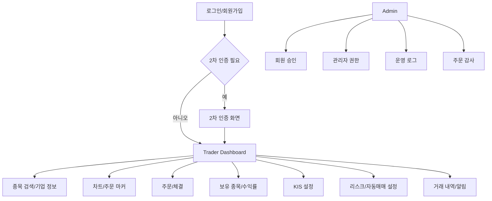
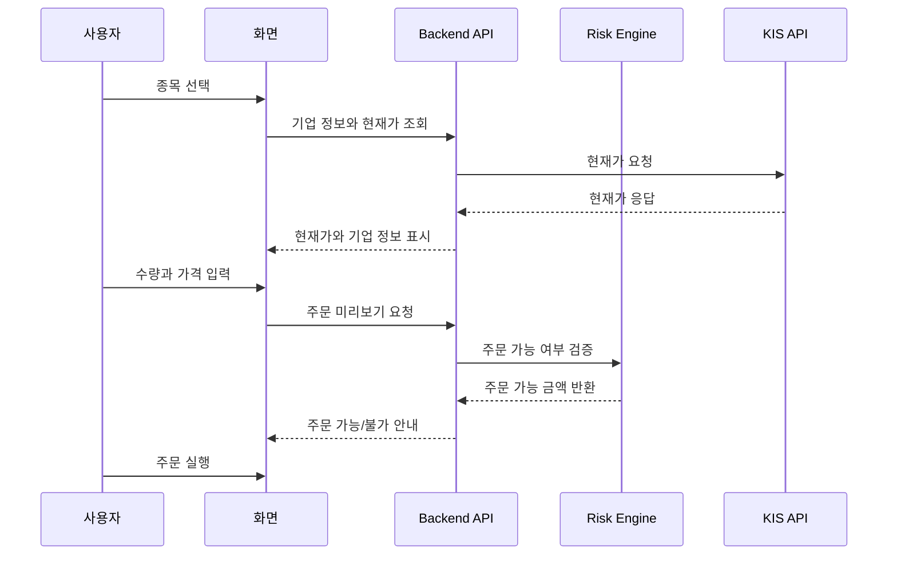
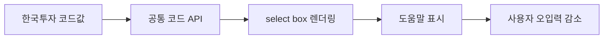

# 프론트엔드에 관심이 있는 학생 관점 포트폴리오


> 주식 투자라는 고위험 도메인에서 사용자가 실수 없이 상태를 이해하고 주문할 수 있도록 Thymeleaf, JavaScript, Bootstrap, Lightweight Charts 기반 화면을 설계하고 구현했습니다.
> 예쁜 화면보다 `상태 인지 -> 위험 확인 -> 주문 미리보기 -> 실행 -> 결과 확인` 흐름을 명확하게 만드는 데 초점을 두었습니다.


| 항목 | 내용 |
| --- | --- |
| 문서 버전 | Career Frontend v2.3 |
| 관심 직무 | Frontend Engineer |
| 한 줄 소개 | 사용자의 주문 실수를 줄이는 투자 대시보드 UI |
| 담당 역할 | Trader 화면, 인증/2FA 화면, KIS 설정 화면, 주문/차트/이력/운영 화면 UX 설계 |
| 주요 기술 | Thymeleaf, JavaScript, HTML/CSS, Bootstrap, Lightweight Charts, Spring Boot REST API |
| 관련 문서 | [README](../../README.md), [아키텍처 문서](../architecture.md), [배포/실행 가이드](../deployment-guide.md) |

## 1. 이 프로젝트에서 해결하려고 한 문제

프론트엔드 관점에서 이 프로젝트의 핵심 문제는 “사용자가 지금 무엇을 보고 있고, 어떤 행동이 위험한지 바로 이해하게 만드는 것”이었습니다. 투자 시스템에서는 작은 오입력이나 상태 착각이 실제 손실로 이어질 수 있습니다.

- 사용자가 지금 모의투자인지 실계좌인지 바로 알 수 있을까요?
- 주문 전 보유 현금과 주문 가능 금액을 이해할 수 있을까요?
- 어려운 증권사 코드값을 직접 외우지 않아도 설정할 수 있을까요?
- AI 판단, 차트, 보유 종목, 리스크 상태를 한 흐름에서 볼 수 있을까요?
- 관리자도 사용자 승인, 권한, 장애 로그를 빠르게 확인할 수 있을까요?

저는 화면을 단순히 꾸미는 것보다, 사용자의 판단 오류와 주문 실수를 줄이는 UX를 만드는 데 집중했습니다.

## 2. 5초 요약

| 질문 | 답 |
| --- | --- |
| 무엇을 만들었나요 | AI 자동매매와 수동 주문을 지원하는 Trader/Admin 화면입니다 |
| 어떤 역할을 맡았나요 | 화면 구조, 주문 흐름, 차트, 설정, 알림, 운영 화면을 설계했습니다 |
| 왜 어려웠나요 | 주식 주문 화면은 정보가 많고, 잘못 누르면 실제 손실로 이어질 수 있습니다 |
| 어떻게 풀었나요 | 상태 배지, 주문 미리보기, 공통코드 select, 리스크 안내, 이력 화면으로 흐름을 나눴습니다 |
| 무엇을 검증했나요 | 로그인, 2FA, 종목 검색, 주문 가능 금액, 차트, 거래 이력, 운영 화면 흐름을 확인했습니다 |

## 3. Demo: 실행 증거

위 GIF는 현재 브라우저 화면에서 사용자가 자동추천 결과를 읽고, 잔고/RMS 상태를 확인하고, 주문 화면에서 차트·거래량·주문 마커를 본 뒤, 감사/재학습 흐름으로 넘어가는 과정을 보여줍니다.

프론트엔드 관점에서는 사용자가 위험한 행동을 하기 전에 필요한 상태를 먼저 보게 만드는지 확인합니다.

| 화면 흐름 | 프론트엔드에서 확인할 UX |
| --- | --- |
| 자동추천 | 총 운용자산, 전략별 성과, 최근 AI 판단을 한 화면에서 읽습니다 |
| RMS 검증 | 계좌 요약, 실계좌 동기화, 전략별 가상 계좌, 잠금장치를 순서대로 확인합니다 |
| 주문 | 종목, 현재가, 주문 가능 금액, 차트 주기(초/분/일/월), 주문 상태별 마커를 함께 확인합니다 |
| 감사/재학습 | 알림, 거래 내역, 백테스트, 재학습 근거를 분리해서 확인합니다 |

Trader 화면은 로컬 실행 후 아래 주소에서 확인할 수 있습니다.

```text
http://localhost:8090/trader
```

실행 절차는 다음과 같습니다.

```bash
cd /Users/zest/git/stoackAI
./gradlew bootRun
```

## 4. Frontend Features: 핵심 기능

### Trader 화면

- 종목 검색, 기업 정보, 현재가, 차트, 주문 영역을 하나의 흐름으로 구성했습니다.
- 검색 결과가 1건이면 자동 선택하고, 여러 건이면 목록에서 선택하도록 했습니다.
- 보유 현금, 미수 가능 여부, 주문 가능 금액을 주문 전에 확인하도록 했습니다.
- 거래 내역, 수익률, 미체결 주문을 별도 영역으로 분리했습니다.

### 차트와 투자 판단 정보

- Lightweight Charts 기반 캔들 차트를 사용했습니다.
- 이동평균선, 거래량, 주문 마커를 함께 보여주도록 구성했습니다.
- AI 판단과 실제 주문 결과를 비교할 수 있도록 관련 화면/API 흐름을 연결했습니다.

### 설정과 보안 UX

- 한국투자 API key, 계좌번호, HTS ID 입력 화면을 사용자별 설정 흐름으로 구성했습니다.
- 어려운 증권사 코드값은 공통코드 기반 select box로 제공했습니다.
- 2차 인증 등록/해제 화면을 별도로 두어 보안 설정을 사용자가 직접 관리할 수 있게 했습니다.
- 실주문, 자동매매, 미수 가능 같은 위험 상태는 화면에서 명확히 드러나도록 했습니다.

### 관리자 화면

- 회원 승인, 관리자 생성/승격/회수 화면을 구성했습니다.
- KIS 설정 상태, 자동매매 상태, 오류 로그, 주문 감사 로그를 운영 화면에서 볼 수 있게 했습니다.
- 운영자가 사고 상황을 빠르게 파악할 수 있도록 기능을 화면 흐름으로 묶었습니다.

## 5. 설계하면서 중요하게 본 판단

| 판단 | 선택 | 이유 |
| --- | --- | --- |
| 화면 우선순위 | 정보 밀도 높은 대시보드 | 트레이딩 화면은 반복 사용자가 빠르게 판단해야 한다고 봤습니다 |
| 코드값 입력 | select box + 도움말 | 증권사 코드를 직접 입력하게 하면 오입력 위험이 높다고 판단했습니다 |
| 위험 기능 표시 | 상태 배지와 확인 흐름 | 실주문/자동매매 상태는 사용자가 즉시 알아야 합니다 |
| 화면 구조 | Thymeleaf fragment 분리 | 기능별 화면을 나누어 유지보수성을 높였습니다 |
| 운영 화면 | 권한/장애/감사 로그 중심 | 관리자도 서비스 운영 흐름을 한 화면에서 파악해야 한다고 봤습니다 |

## 6. Architecture: 화면 구조



### 주요 화면 파일

```text
src/main/resources/templates
├── auth
│   ├── auth.html
│   └── two-factor.html
├── trader
│   ├── dashboard.html
│   └── fragments
│       ├── home.html
│       ├── company.html
│       ├── trade.html
│       ├── portfolio.html
│       ├── history.html
│       ├── kis.html
│       └── settings-modal.html
└── admin
    ├── users.html
    └── operations.html
```

## 7. 주요 흐름

### 주문 화면 흐름



### 공통코드 기반 입력 흐름



## 8. Runbook: 실행 절차

```bash
cd /Users/zest/git/stoackAI
./gradlew bootRun
```

접속 경로:

```text
http://localhost:8090/trader
http://localhost:8090/auth
http://localhost:8090/admin/users
http://localhost:8090/admin/operations
```

## 9. Troubleshooting: 문제 해결

| 증상 | 확인할 것 | 해결 |
| --- | --- | --- |
| 화면 스타일이 깨집니다 | static CSS/JS 경로를 확인합니다 | `src/main/resources/static` 경로를 확인합니다 |
| 차트가 보이지 않습니다 | Lightweight Charts vendor asset을 확인합니다 | `static/vendor/lightweight-charts` 파일을 확인합니다 |
| 주문 가능 금액이 보이지 않습니다 | KIS 설정과 API 응답을 확인합니다 | 사용자별 KIS 설정과 백엔드 로그를 확인합니다 |
| 2차 인증 화면으로 이동하지 않습니다 | 사용자 2FA 설정 상태를 확인합니다 | `/api/security/two-factor/status` 흐름을 확인합니다 |
| 관리자 화면 접근이 안 됩니다 | 사용자 role을 확인합니다 | `ADMIN` 권한과 세션 상태를 확인합니다 |

## 10. Interview Notes: 면접 답변

### 1분 소개

저는 ZEST AI Trader에서 사용자가 투자 상태를 이해하고 실수 없이 주문할 수 있도록 Trader/Admin 화면을 설계했습니다. 주식 주문 화면은 단순히 보기 좋은 UI보다 위험 상태를 정확히 보여주는 것이 중요하다고 판단했습니다. 그래서 주문 미리보기, 리스크 안내, 공통코드 select, 2차 인증, 운영 로그 화면을 통해 사용자가 현재 상태를 놓치지 않도록 구성했습니다.

### STAR 답변 예시

| 구분 | 답변 |
| --- | --- |
| 상황 | 증권사 API 설정과 주문 화면에는 사용자가 이해하기 어려운 코드값과 위험 행동이 많았습니다 |
| 과제 | 사용자가 실수하지 않도록 화면 흐름과 입력 방식을 단순화해야 했습니다 |
| 행동 | 공통코드 select box, 주문 미리보기, 상태 배지, 리스크 안내를 화면에 반영했습니다 |
| 결과 | 사용자가 주문 전 상태를 더 명확히 확인하고, 운영자도 장애와 권한 상태를 볼 수 있는 화면이 되었습니다 |

### 꼬리 질문 대비

| 질문 | 답변 방향 |
| --- | --- |
| 프론트엔드에서 가장 중요하게 본 점은 무엇인가요 | 사용자가 위험 상태를 놓치지 않게 하는 것이었습니다 |
| 왜 마케팅형 화면이 아니라 대시보드형 화면인가요 | 트레이딩 화면은 반복 사용과 빠른 판단이 중요하기 때문입니다 |
| 어려운 코드값은 어떻게 처리했나요 | 공통코드 API와 select box로 변환했습니다 |
| 보안 UX는 어떻게 반영했나요 | 2FA, 실주문 상태, 권한 상태를 화면에서 확인할 수 있게 했습니다 |

## 11. Portfolio Checklist: 제출 전 점검

| 체크 | 제가 확인한 기준 |
| --- | --- |
| 문제 정의 | 투자 UI에서 사용자의 실수가 왜 위험한지 설명했습니다 |
| 담당 범위 | Trader, Auth, Admin 화면 범위를 정리했습니다 |
| 화면 흐름 | 검색, 주문, 차트, 이력, 설정 흐름을 연결했습니다 |
| UX 판단 | 위험 행동을 확인하는 흐름을 설명했습니다 |
| 운영 화면 | 관리자와 운영자의 사용 시나리오를 포함했습니다 |
| 면접 전환 | UI 선택 이유를 면접 답변으로 설명할 수 있게 정리했습니다 |

## 12. Reference Docs: 참고 문서

| 문서 | 내용 |
| --- | --- |
| [README](../../README.md) | 전체 프로젝트 README |
| [docs/architecture.md](../architecture.md) | 전체 아키텍처 |
| [docs/deployment-guide.md](../deployment-guide.md) | 실행/배포 가이드 |
