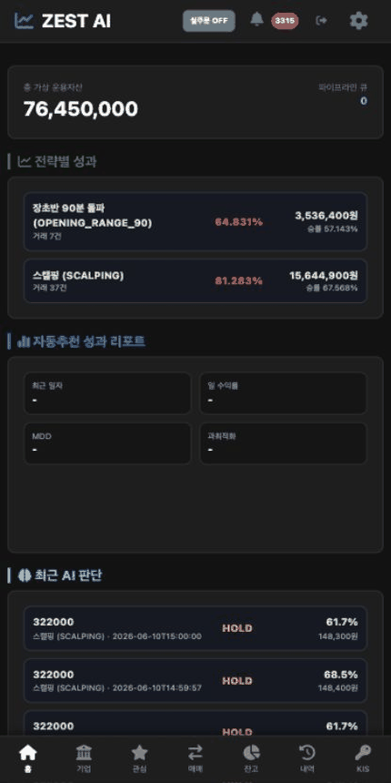
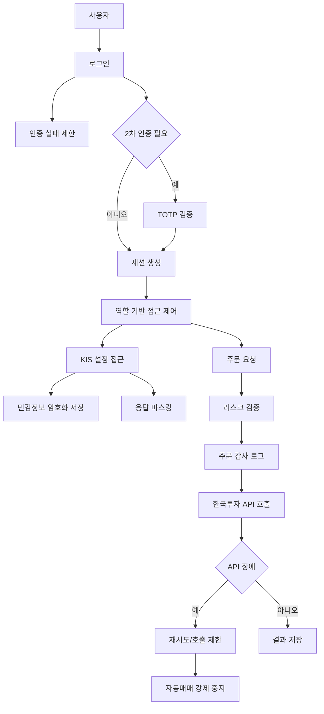
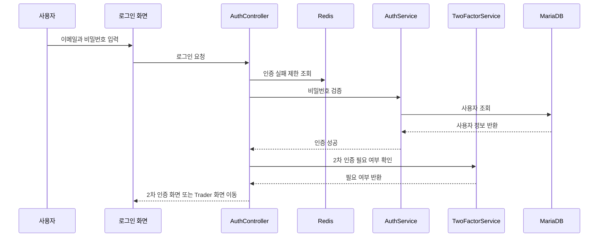
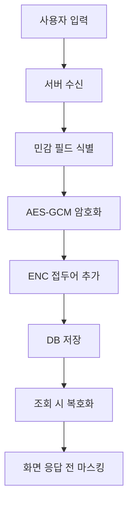
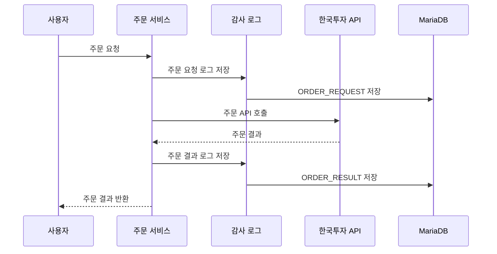

# 보안에 관심이 있는 학생 관점 포트폴리오


> 실제 계좌와 주문 API를 다루는 투자 시스템에서 API key 암호화, 2차 인증, 개인정보 마스킹, 주문 감사, 장애 시 자동매매 중지까지 보안 중심 구조를 설계했습니다.
> 보안을 기능 마지막에 붙이는 것이 아니라 `인증 -> 권한 -> secret -> 주문 -> 감사 -> 장애 대응` 흐름 전체에 넣는 것을 목표로 했습니다.



| 항목 | 내용 |
| --- | --- |
| 문서 버전 | Career Security v2.3 |
| 관심 직무 | Security Engineer / Application Security |
| 한 줄 소개 | 실계좌 주문 시스템의 보안 경계를 설계한 포트폴리오 |
| 담당 역할 | 인증/2FA, CSRF, 권한, 민감정보 암호화, 마스킹, 주문 감사, 호출 제한, 장애 시 자동정지 설계 |
| 주요 기술 | Spring Security, BCrypt, TOTP, CSRF, AES-GCM, Redis, AWS KMS, OSV scan |
| 관련 문서 | [README](../../README.md), [보안 운영 가이드](../SECURITY_OPERATION_GUIDE.md), [보안 점검 보고서](../SECURITY_PENTEST_REPORT.md) |

## 1. 이 프로젝트에서 해결하려고 한 문제

보안 관점에서 이 프로젝트의 핵심 문제는 “실제 돈이 움직일 수 있는 시스템을 어떻게 안전하게 막고 추적할 것인가”였습니다. 자동매매 시스템은 로그인, API key, 계좌번호, 주문 요청, 외부 API 장애가 모두 보안 리스크가 될 수 있습니다.

- 사용자가 본인 계정으로 안전하게 로그인할 수 있을까요?
- API key와 계좌번호가 DB나 화면에서 노출되지 않을까요?
- 권한 없는 사용자가 관리자 화면이나 주문 기능에 접근하지 못하게 할 수 있을까요?
- 주문 사고가 났을 때 누가 어떤 요청을 보냈는지 추적할 수 있을까요?
- 외부 API 장애 중 반복 주문이 발생하지 않게 막을 수 있을까요?

저는 이 질문에 답하기 위해 인증, 권한, secret 관리, 주문 감사, 장애 대응을 하나의 보안 흐름으로 설계했습니다.

## 2. 5초 요약

| 질문 | 답 |
| --- | --- |
| 무엇을 만들었나요 | 자동매매 시스템의 인증, secret, 주문 감사, 장애 대응 보안 구조입니다 |
| 어떤 역할을 맡았나요 | 2FA, CSRF, AES-GCM 암호화, 마스킹, 감사 로그, 자동정지 흐름을 설계했습니다 |
| 왜 어려웠나요 | 계좌와 API key, 주문 요청은 노출되거나 오용되면 실제 손실로 이어질 수 있습니다 |
| 어떻게 풀었나요 | 인증, 권한, 민감정보 저장, 주문 감사, 장애 대응을 분리해서 방어했습니다 |
| 무엇을 검증했나요 | 로그인/2FA, 마스킹, 주문 감사, 호출 제한, OSV 의존성 점검 흐름을 확인했습니다 |

## 3. Demo: 실행 증거

위 GIF는 현재 브라우저 화면에서 실주문 잠금, RMS 검증, 주문 상태별 차트 마커, 알림, 주문 감사, 재학습 흐름이 사용자에게 어떻게 드러나는지 보여줍니다.

보안 관점에서는 기능이 보이는지보다 위험한 행동을 어디에서 막고 추적하는지 확인합니다.

| 화면 흐름 | 보안에서 확인할 통제 |
| --- | --- |
| 자동추천 | AI 판단은 주문 조건의 일부일 뿐이며 바로 실주문으로 이어지지 않습니다 |
| RMS 검증 | 실주문 잠금, 자동주문 허용, 손실 한도, 전략별 예산을 검증합니다 |
| 주문 | dry-run, 실주문 요청, 실제 체결 완료를 구분하고 민감 설정은 마스킹합니다 |
| 감사/재학습 | 주문 결과, 관리자 행위, 장애 로그를 추적 가능한 형태로 남깁니다 |

보안 점검은 GitHub Actions workflow와 로컬 테스트 흐름으로 확인합니다.

```bash
cd /Users/zest/git/stoackAI
./gradlew test
```

관련 workflow:

```text
.github/workflows/security.yml
```

## 4. Security Features: 핵심 기능

### 인증과 2차 인증

- BCrypt 기반 비밀번호 검증을 적용했습니다.
- TOTP 기반 2차 인증을 구현했습니다.
- Google Authenticator, Microsoft Authenticator 등과 호환되는 흐름을 고려했습니다.
- 로그인과 2차 인증 실패는 Redis와 DB 로그를 통해 제한하고 기록합니다.

### 권한과 CSRF

- 사용자 역할을 기준으로 Trader/Admin 접근을 분리했습니다.
- CSRF token cookie/header 검증을 적용했습니다.
- 관리자 계정 생성, 승격, 회수 흐름을 별도로 관리했습니다.
- 본인 관리자 권한 회수 같은 위험 행동은 차단하도록 설계했습니다.

### 민감정보 보호

- KIS App Key, App Secret, 계좌번호, HTS ID, TOTP Secret을 AES-GCM으로 암호화 저장했습니다.
- 화면/API 응답에서는 계좌번호와 식별값을 마스킹했습니다.
- 개발/운영 DB 비밀번호는 AWS KMS 기반 외부화 구조를 반영했습니다.
- 저장소와 설정 파일에 평문 secret이 남지 않도록 했습니다.

### 주문 감사와 장애 대응

- 주문 요청, 주문 결과, 취소, 정정 이벤트를 감사 로그로 남겼습니다.
- 한국투자 API 호출 제한, timeout, retry, circuit breaker를 적용했습니다.
- 외부 API 장애가 반복되면 자동매매를 강제 중지하도록 설계했습니다.
- OSV 의존성 점검을 GitHub Actions에 연결했습니다.

## 5. 설계하면서 중요하게 본 판단

| 판단 | 선택 | 이유 |
| --- | --- | --- |
| 계정 보호 | 비밀번호 + TOTP + 실패 제한 | 계정 탈취와 무차별 대입을 함께 줄이기 위해 선택했습니다 |
| 민감정보 저장 | AES-GCM 암호화 + 마스킹 | DB 유출과 화면 노출 위험을 줄이기 위해 선택했습니다 |
| 주문 추적 | 주문 감사 로그 | 주문 사고 발생 시 요청과 결과를 추적해야 했습니다 |
| 외부 API 장애 | retry + rate limit + force stop | 장애 중 반복 주문을 막기 위해 선택했습니다 |
| 운영 secret | AWS KMS 외부화 | 개발/운영 secret이 설정 파일에 남지 않게 하기 위해 선택했습니다 |
| 의존성 보안 | OSV scan | 알려진 취약점이 포함되지 않도록 점검했습니다 |

## 6. Architecture: 보안 구조



## 7. 주요 흐름

### 인증 흐름



### 민감정보 저장 흐름



### 주문 감사 흐름



## 8. 보호 대상

| 보호 대상 | 저장 방식 | 화면/API 응답 |
| --- | --- | --- |
| 한국투자 App Key | AES-GCM 암호화 | 일부 마스킹 |
| 한국투자 App Secret | AES-GCM 암호화 | 표시하지 않음 |
| 계좌번호 | AES-GCM 암호화 | 뒤 일부만 표시 |
| HTS ID | AES-GCM 암호화 | 마스킹 |
| TOTP Secret | AES-GCM 암호화 | 등록 시에만 표시 |
| 비밀번호 | BCrypt hash | 표시하지 않음 |
| 개발/운영 DB 비밀번호 | AWS KMS 암호문 외부화 | 화면 노출 없음 |

## 9. Runbook: 점검 절차

```bash
cd /Users/zest/git/stoackAI
./gradlew test
```

GitHub Actions 보안 점검:

```text
.github/workflows/security.yml
```

## 10. Troubleshooting: 문제 해결

| 증상 | 확인할 것 | 해결 |
| --- | --- | --- |
| 로그인이 반복 실패합니다 | Redis 실패 제한과 DB 실패 로그를 확인합니다 | 제한 시간과 실패 사유를 확인합니다 |
| 2FA가 실패합니다 | 서버 시간과 Authenticator 앱 시간을 확인합니다 | 시간 동기화 후 다시 시도합니다 |
| 민감정보가 노출됩니다 | 응답 DTO와 마스킹 로직을 확인합니다 | API 응답 전 마스킹을 적용합니다 |
| 주문 감사가 누락됩니다 | 주문 요청/결과 저장 흐름을 확인합니다 | 감사 로그 저장 지점을 확인합니다 |
| API 장애 중 주문이 반복됩니다 | retry, circuit breaker, force stop 설정을 확인합니다 | 장애 시 자동매매 중지 흐름을 확인합니다 |

## 11. Interview Notes: 면접 답변

### 1분 소개

저는 ZEST AI Trader에서 실계좌와 주문 API를 다루는 시스템의 보안 구조를 설계했습니다. 로그인과 2차 인증, CSRF, 역할 기반 접근 제어뿐 아니라 KIS API key와 계좌번호 암호화, 화면/API 마스킹, 주문 감사 로그, 장애 시 자동매매 중지까지 연결했습니다. 보안을 기능 마지막에 붙이는 것이 아니라 인증, 설정, 주문, 운영 로그 전반에 넣는 것을 목표로 했습니다.

### STAR 답변 예시

| 구분 | 답변 |
| --- | --- |
| 상황 | 자동매매 시스템은 계정 탈취, API key 노출, 반복 주문 같은 위험이 있었습니다 |
| 과제 | 사용자의 민감정보를 보호하면서 주문 사고를 추적할 수 있어야 했습니다 |
| 행동 | AES-GCM 암호화, 마스킹, 2FA, CSRF, 주문 감사 로그, 자동정지 흐름을 적용했습니다 |
| 결과 | 민감정보 노출을 줄이고, 주문 요청과 장애 상황을 추적할 수 있는 구조가 되었습니다 |

### 꼬리 질문 대비

| 질문 | 답변 방향 |
| --- | --- |
| API key는 어떻게 보호했나요 | AES-GCM으로 암호화 저장하고 응답에서는 마스킹했습니다 |
| 2FA는 왜 필요했나요 | 계정 탈취 시 주문 기능까지 악용될 수 있기 때문입니다 |
| 주문 감사는 왜 중요한가요 | 사고 발생 시 누가 어떤 주문을 요청했는지 추적해야 하기 때문입니다 |
| 장애 대응도 보안인가요 | 반복 주문이나 비정상 호출을 막는 운영 보안 관점이라고 봤습니다 |

## 12. Portfolio Checklist: 제출 전 점검

| 체크 | 제가 확인한 기준 |
| --- | --- |
| 문제 정의 | 실계좌 시스템에서 보안이 왜 중요한지 설명했습니다 |
| 보호 대상 | API key, 계좌번호, TOTP, 비밀번호 보호 방식을 정리했습니다 |
| 인증/권한 | 로그인, 2FA, CSRF, 역할 제어를 포함했습니다 |
| 감사 | 주문 요청과 결과 추적 구조를 설명했습니다 |
| 장애 대응 | 외부 API 장애와 자동정지 흐름을 포함했습니다 |
| 면접 전환 | 보안 설계 이유를 면접 답변으로 설명할 수 있게 정리했습니다 |

## 13. Reference Docs: 참고 문서

| 문서 | 내용 |
| --- | --- |
| [README](../../README.md) | 전체 프로젝트 README |
